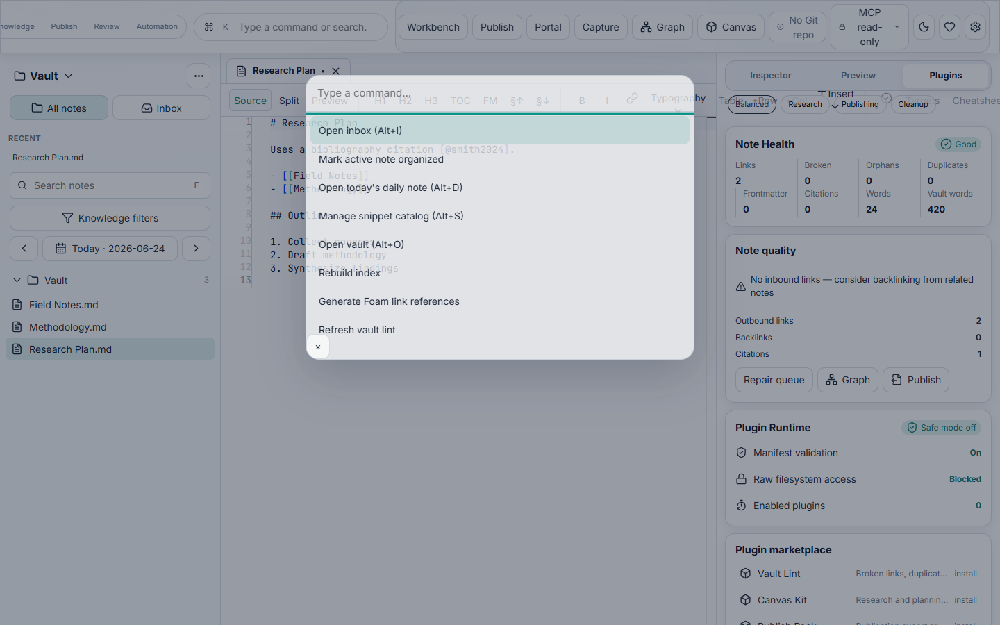

# Scriptor

[](LICENSE)
[](CHANGELOG.md)
[](https://github.com/AmirrezaFarnamTaheri/Scriptor/stargazers)

**The instrument for serious writing.** Scriptor is a low-overhead, desktop-native, local-first Markdown knowledge workspace for long-form writing, research, citations, graph navigation, canvas boards, exports, Git, and permissioned AI/MCP automation.


**Maintainer:** Amirreza "Farnam" Taheri · [taherifarnam@gmail.com](mailto:taherifarnam@gmail.com)  
**Repository:** [github.com/AmirrezaFarnamTaheri/Scriptor](https://github.com/AmirrezaFarnamTaheri/Scriptor)

## Why Scriptor

- **Local-first:** Plain Markdown on disk — no proprietary database, no lock-in.
- **Desktop-native:** Tauri 2 shell with Rust vault kernel, SQLite indexer, and optional headless daemon.
- **Research-ready:** Backlinks, citations, knowledge graph, vault health, and Pandoc export profiles.
- **Calm workspace:** Glass shell with split editor/preview, inspector presets, and distraction-free mode.
- **Automation with boundaries:** Git integration, MCP read-only tools, plugin safe mode, and draft/write-approved AI flows.

## Quick start

**Requirements:** Node.js 22+, pnpm 9+, Rust stable (for building from source).

```powershell
pnpm install
pnpm desktop:dev
```

Full walkthrough: [`docs/guides/GETTING_STARTED.md`](docs/guides/GETTING_STARTED.md).

## Downloads

Pre-built installers are published on [GitHub Releases](https://github.com/AmirrezaFarnamTaheri/Scriptor/releases) when a `v*` tag is pushed.

| Platform | Formats |
|----------|---------|
| Windows | MSI, NSIS |
| macOS | DMG |
| Linux | DEB, AppImage |

For PDF and advanced exports, install [Pandoc](https://pandoc.org/) separately — see [`docs/release/PANDOC_STRATEGY.md`](docs/release/PANDOC_STRATEGY.md).

## More surfaces

| Surface | Screenshot |
|---------|------------|
| Knowledge graph |  |
| Command palette |  |

All UI screenshots: [`docs/assets/screenshots/`](docs/assets/screenshots/).

## Capabilities

v0.1 ships a complete research workspace: desktop shell, vault kernel, SQLite indexer, export runner, Git integration, canvas boards, MCP tools, plugin safe mode, headless daemon IPC, terminal UI, and the glass workspace shell.

See [`docs/CAPABILITIES.md`](docs/CAPABILITIES.md) for the full surface map and validation commands.

## Development

```powershell
pnpm dev --host 127.0.0.1      # Web shell (browser)
pnpm build                     # Production frontend build
pnpm lint
pnpm check:release             # Full local release gate
pnpm desktop:build             # Desktop installers
pnpm screenshots:capture:web   # Regenerate docs screenshots
cargo check --workspace
```

## Documentation

| Document | Purpose |
|---|---|
| [`docs/README.md`](docs/README.md) | Documentation index |
| [`PRODUCT.md`](PRODUCT.md) | Product principles and audience |
| [`DESIGN.md`](DESIGN.md) | Visual and interaction rules |
| [`docs/CAPABILITIES.md`](docs/CAPABILITIES.md) | Shipped surfaces and validation |
| [`CHANGELOG.md`](CHANGELOG.md) | Release history |
| [`CONTRIBUTING.md`](CONTRIBUTING.md) | Contribution guide |
| [`SECURITY.md`](SECURITY.md) | Security reporting |
| [`MAINTAINERS.md`](MAINTAINERS.md) | Maintainer contact |
| [`COMMERCIAL-LICENSING.md`](COMMERCIAL-LICENSING.md) | Commercial license inquiries |
| [`docs/release/SIGNING.md`](docs/release/SIGNING.md) | Release signing and notarization |
| [`docs/release/PANDOC_STRATEGY.md`](docs/release/PANDOC_STRATEGY.md) | Pandoc setup for exports |

## License

Scriptor is licensed under the **GNU Affero General Public License v3.0** for non-commercial use. See [`LICENSE`](LICENSE).

**Commercial use** (proprietary redistribution, SaaS without AGPL compliance, etc.) requires a separate license — see [`COMMERCIAL-LICENSING.md`](COMMERCIAL-LICENSING.md) and contact [taherifarnam@gmail.com](mailto:taherifarnam@gmail.com).

## Support Scriptor

- **Star the repo:** [github.com/AmirrezaFarnamTaheri/Scriptor/stargazers](https://github.com/AmirrezaFarnamTaheri/Scriptor/stargazers)
- **Report issues:** [GitHub Issues](https://github.com/AmirrezaFarnamTaheri/Scriptor/issues)
- **Optional donations** (Settings → Support Scriptor, or below):

| Network | Address |
|---|---|
| BTC | `bc1q68g4m4denjw4smhvwmnz5fychuj3ge2vupx07w` |
| ETH | `0xbd5af5d1517317111db9523d6bb42fceae887abb` |
| TRON | `TRjFLA1Dd32Bw1i3FxjZW5dmVub5UfXFSS` |
