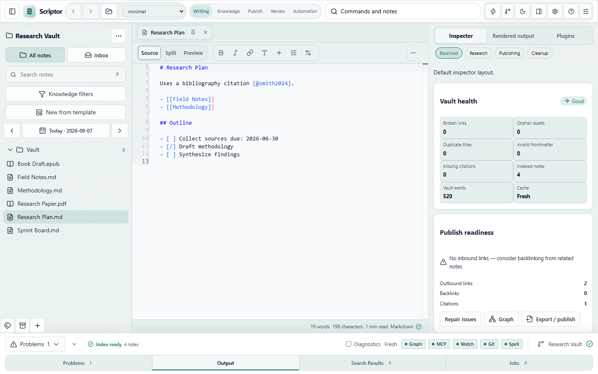
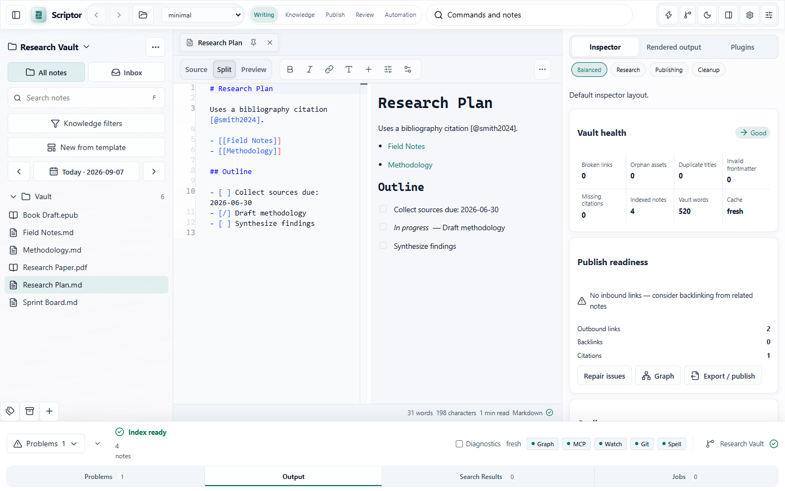
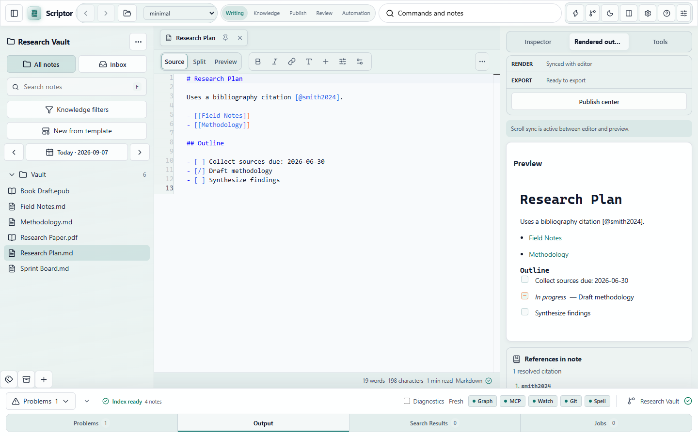
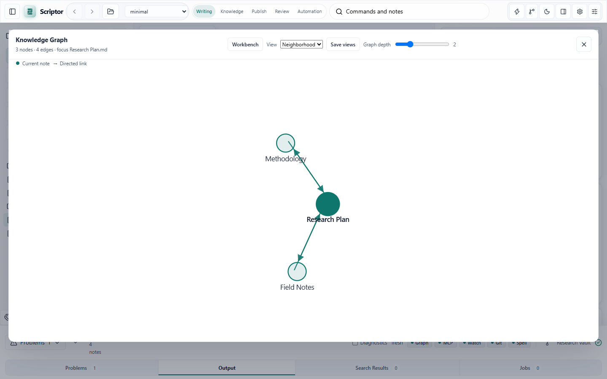
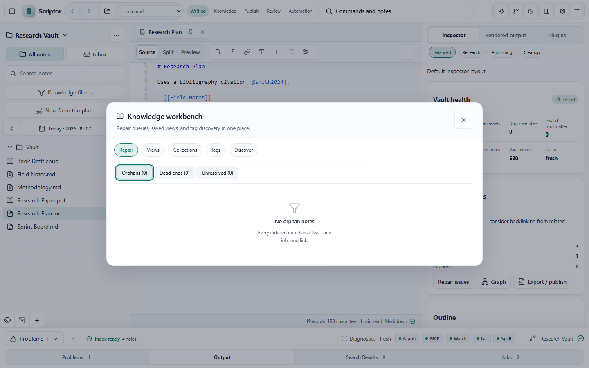
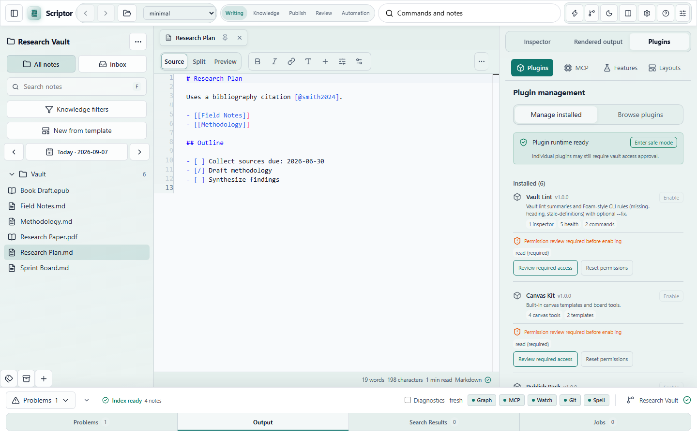
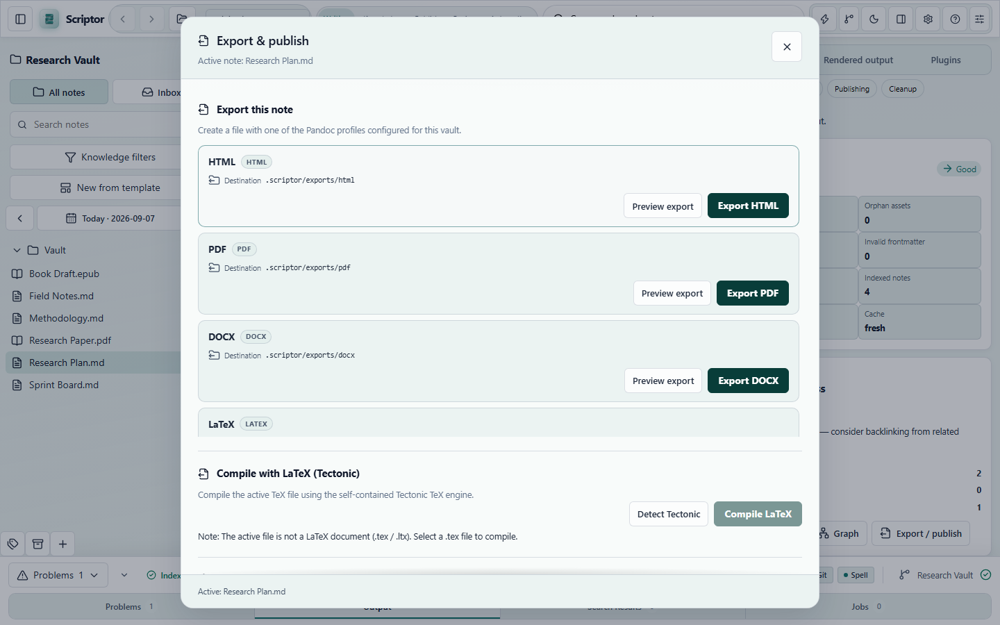

<div align="center">

# Scriptor

**A local-first Markdown workspace for serious writing and research.**

[](VERSION)
[](LICENSE)
[](#download)
[](#tech-stack)
[](https://github.com/AmirrezaFarnamTaheri/Scriptor/actions/workflows/ci.yml)

Your notes remain ordinary Markdown files. Scriptor adds editing, backlinks, citations, version history, publishing, and permissioned automation.

[Download](#download) · [Getting started](docs/guides/GETTING_STARTED.md) · [Capabilities](docs/CAPABILITIES.md) · [Plugin authoring](docs/plugins/AUTHOR_GUIDE.md) · [Contributing](CONTRIBUTING.md)

</div>



## The product

Scriptor opens a folder of Markdown and adds search, backlinks, history, previews, and health checks. Markdown remains the source of truth, so every note stays readable in other editors.

Scriptor is designed for long-running projects such as books, theses, technical documentation, research collections, and maintained knowledge bases. A Tauri desktop shell provides the interface while Rust services handle vault access, indexing, Git, export, and local IPC.

| Work with your material | What Scriptor provides |
|---|---|
| **Write and revise** | Source, split, and rendered views; outline navigation; snippets; configurable editor; note history |
| **Build evidence** | Wikilinks, backlinks, citations, graph exploration, health checks, unresolved-link repair |
| **Publish reproducibly** | Named Pandoc profiles for HTML, PDF, DOCX, LaTeX, ePub, and Reveal.js |
| **Automate with boundaries** | Git-aware workflows, audited MCP tools, permissioned plugins, and a local daemon |

## See it in use

| Write with source and preview | Inspect structure and note quality |
|---|---|
|  |  |

| Explore connections | Repair and organize the vault |
|---|---|
|  |  |

| Extend the workspace | Publish from named profiles |
|---|---|
|  |  |

The [screenshot catalog](docs/assets/screenshots/README.md) also covers dark mode, Git, conflict resolution, the command palette, MCP, settings, vault health, note history, keyboard shortcuts, onboarding, and compact layouts. The capture script waits for data and panels to finish loading and fails if a screen remains in a loading or degraded state.

## Features

- **Write** — CodeMirror 6 (default) with Monaco option, split and preview modes, format toolbar, snippets, distraction-free mode, keyboard shortcut editor
- **Organize** — virtualized vault tree, inbox, daily notes, note types, templates, saved views
- **Connect** — wikilinks, backlinks, knowledge graph with keyboard navigation, knowledge workbench, unresolved link repair
- **Cite** — CSL styles, inline `[@key]` citations, bibliography preview, local bibliography files
- **Publish** — Pandoc export profiles (HTML, PDF, DOCX, LaTeX, ePub, Reveal.js), local Starlight publishing
- **Automate** — Git with 3-way conflict resolver, MCP 22 tools with hash-chained mutation audit JSONL, plugin catalog with safe mode, headless daemon with tracing
- **Visualize** — canvas boards (lazy-loaded, resvg worker offload), portal quick-capture
- **Operate** — command palette, workspace modes, vault health dashboard, terminal UI, scheduled snapshots
- **Spellcheck** — multi-locale Hunspell, optional LanguageTool

See [`docs/CAPABILITY-MATURITY.md`](docs/CAPABILITY-MATURITY.md) for the current status of shipped, experimental, and design-only features.

## Get Scriptor

Production installers are published as GitHub Release assets. The current version is **1.0.7**.

- **Windows** — `.msi` and `.exe` (Tauri 2)
- **macOS** — `.dmg` and `.app` (Apple Silicon and Intel)
- **Linux** — `.deb`, `.rpm`, and `.AppImage`

> **Trust status.** The official upstream installers are intentionally **unsigned**. Releases ship with SHA-256 checksums, a CycloneDX SBOM, a release receipt, source identity evidence, and GitHub provenance attestations. See [`docs/RELEASE-SECURITY.md`](docs/RELEASE-SECURITY.md) for the full verification workflow before you install.

[Download the latest release](https://github.com/AmirrezaFarnamTaheri/Scriptor/releases) or [build from source](#build-from-source).

## Tech stack

- **Desktop shell** — Tauri 2
- **Renderer** — React 19, Vite 8, TypeScript 6, Lucide React
- **Kernel** — Rust 1.96 (2024 Edition) workspace crates (`vault`, `indexer`, `native-git`, `daemon`, `ipc`, `system-bridge`, `export-runner`, `publish-runner`, `canvas-engine`, `cli`, `embeddings`, `tantivy-indexer`, `citation-engine`, `wasm-runtime`, `capture`)
- **Persistence** — SQLite WAL + FTS5 in the vault kernel
- **IPC** — postcard-framed, HMAC-authenticated local RPC (`scriptor-ipc` → `scriptor-daemon`)
- **Contracts** — Rust `ts-rs` generated TypeScript types
- **Styling** — semantic CSS custom properties; no Tailwind, no remote fonts
- **Editor** — CodeMirror 6 (default) with Monaco as an advanced non-default option

## Build from source

### Requirements

- Node.js `22.16.0` (engines: `>=22.12.0`)
- pnpm `10.33.0` (managed by Corepack)
- Rust `1.96.0` (via `rustup`, components: `rustfmt`, `clippy`)
- PowerShell 7 (`pwsh`) for release, container, and benchmark scripts
- Tauri 2 platform dependencies for your OS

### First-run

```powershell
corepack enable
corepack prepare pnpm@10.33.0 --activate
pnpm install --frozen-lockfile
rustup toolchain install 1.96.0 --profile minimal --component rustfmt --component clippy
rustup default 1.96.0
```

### Run

```powershell
pnpm web:dev          # web shell only (development and visual tests)
pnpm desktop:dev      # Tauri desktop shell
```

### Verify

Fast repository-native checks:

```powershell
pnpm version:check
pnpm lint:actions
pnpm lint:boundaries
pnpm check:i18n
pnpm check:docs
pnpm check:source
pnpm check:frontend-quality
```

Full release gate:

```powershell
pnpm install --frozen-lockfile
pnpm lint
pnpm build
pnpm check:release
cargo fmt --all --check
cargo clippy --workspace --all-targets -- -D warnings
cargo test --workspace
```

`pnpm check:release` runs contract runners, Rust tests, Playwright E2E and visual suites, accessibility audits, daemon and TUI smoke tests, and performance gates. Packaging and release-evidence verification are documented in [`scripts/release/README.md`](scripts/release/README.md).

## Architecture

The current runtime topology, trust boundaries, and crate ownership are documented in [`docs/ARCHITECTURE.md`](docs/ARCHITECTURE.md). Container and context diagrams live in [`docs/architecture/c4-container.md`](docs/architecture/c4-container.md) and [`docs/architecture/c4-context.md`](docs/architecture/c4-context.md).

| Plane | Entry points |
|---|---|
| Desktop | `apps/desktop/src-tauri/src/lib.rs`, `src/App.tsx` |
| Vault | `crates/vault/src/lib.rs` |
| Index / search / graph | `crates/indexer/src/lib.rs` |
| Daemon IPC | `crates/daemon/src/lib.rs`, `crates/ipc/src/lib.rs` |
| Git | `crates/native-git/src/lib.rs` |
| External tools | `crates/system-bridge/src/process.rs` |
| Frontend packages | `packages/*/src/index.ts` |

## Principles

- **Local-first.** Markdown remains the source of truth and stays portable.
- **Explicit authority.** Destructive, secret, network, process, backup, and publishing actions require scoped authorization.
- **Bounded work.** Scans, graph traversals, event queues, subprocess output, logs, and audit tails have explicit limits.
- **Recoverable mutation.** Git commits isolate the index, MCP writes use intent/outcome records, and restores verify manifests before promotion.
- **One contract per boundary.** Rust IPC definitions generate TypeScript contracts; runtime JSON is validated before use.
- **Honest maturity.** Implemented, experimental, and design-only capabilities are documented separately in [`docs/CAPABILITY-MATURITY.md`](docs/CAPABILITY-MATURITY.md).

## Documentation

| Audience | Start here |
|---|---|
| New user | [`docs/guides/GETTING_STARTED.md`](docs/guides/GETTING_STARTED.md) |
| Curious about capabilities | [`docs/CAPABILITIES.md`](docs/CAPABILITIES.md) and [`docs/CAPABILITY-MATURITY.md`](docs/CAPABILITY-MATURITY.md) |
| Plugin author | [`docs/plugins/AUTHOR_GUIDE.md`](docs/plugins/AUTHOR_GUIDE.md) |
| Contributor | [`CONTRIBUTING.md`](CONTRIBUTING.md) and [`AGENTS.md`](AGENTS.md) |
| Security researcher | [`SECURITY.md`](SECURITY.md) and [`docs/ENCRYPTION-THREAT-MODEL.md`](docs/ENCRYPTION-THREAT-MODEL.md) |
| Release manager | [`docs/RELEASE-CHECKLIST.md`](docs/RELEASE-CHECKLIST.md) and [`docs/RELEASE-SECURITY.md`](docs/RELEASE-SECURITY.md) |
| Architect | [`docs/ARCHITECTURE.md`](docs/ARCHITECTURE.md) and [`docs/architecture/`](docs/architecture/) |
| Auditor | [`docs/_archived/AUDIT-2026-08-23.md`](docs/_archived/AUDIT-2026-08-23.md) and [`docs/FINAL-REMEDIATION-REPORT.md`](docs/FINAL-REMEDIATION-REPORT.md) |

Full index: [`docs/README.md`](docs/README.md).

## Support

- **Issues** — <https://github.com/AmirrezaFarnamTaheri/Scriptor/issues>
- **Email** — Amirreza "Farnam" Taheri, [taherifarnam@gmail.com](mailto:taherifarnam@gmail.com)
- **Security** — follow [`SECURITY.md`](SECURITY.md); do not file public issues for vulnerabilities

## Contributing

Scriptor welcomes contributions. The full workflow, contributor expectations, and required proof gates are in [`CONTRIBUTING.md`](CONTRIBUTING.md). Before opening a pull request:

1. Read [`PRODUCT.md`](PRODUCT.md), [`DESIGN.md`](DESIGN.md), [`docs/ARCHITECTURE.md`](docs/ARCHITECTURE.md), and [`docs/CAPABILITY-MATURITY.md`](docs/CAPABILITY-MATURITY.md).
2. Add a failing behavioral test first when practical.
3. Run the full verification list above; every gate must pass on the exact commit.
4. Update [`CHANGELOG.md`](CHANGELOG.md) and any affected docs with the change.

## Project status

**Active development.** v1.0.7 is the current early production candidate. Desktop, vault, indexer, knowledge, Git, export, daemon, and web surfaces are implemented and shipped. The capability ledger in [`docs/CAPABILITY-MATURITY.md`](docs/CAPABILITY-MATURITY.md) is authoritative for what is supported, experimental, or design-only. Mobile, encrypted vaults, local embeddings, Tantivy, and the WASM host remain experimental or design-only.

## License

Scriptor is licensed under **GNU AGPL-3.0-or-later**. Commercial use is allowed when the license obligations are followed. Organizations that do not want to comply with the AGPL may request a separate commercial license; see [`COMMERCIAL-LICENSING.md`](COMMERCIAL-LICENSING.md).

## Maintainer

Amirreza "Farnam" Taheri · [taherifarnam@gmail.com](mailto:taherifarnam@gmail.com) · [GitHub](https://github.com/AmirrezaFarnamTaheri/Scriptor)
