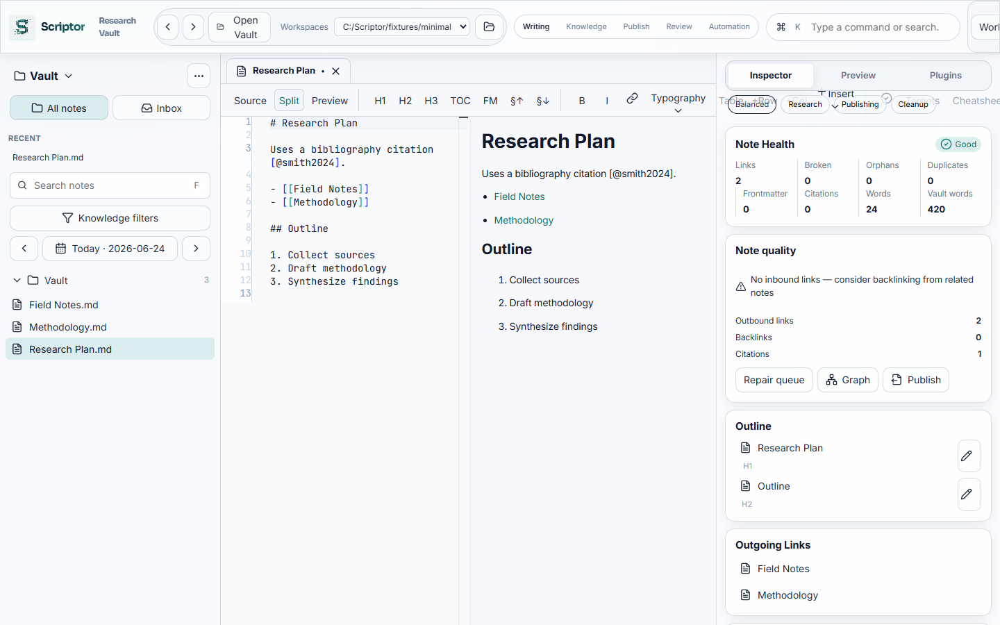

# Scriptor Documentation

Complete documentation for **Scriptor v0.1.0** — product, design, architecture, contracts, release, and validation.

## Start here

| Document | Audience | Purpose |
|----------|----------|---------|
| [`../README.md`](../README.md) | Everyone | Project overview, install, and support |
| [`guides/GETTING_STARTED.md`](./guides/GETTING_STARTED.md) | New users | First vault, workflows, and export setup |
| [`CAPABILITIES.md`](./CAPABILITIES.md) | Users & contributors | Feature map and validation commands |
| [`../CHANGELOG.md`](../CHANGELOG.md) | Everyone | Release history |

## Product

| Document | Purpose |
|----------|---------|
| [`../PRODUCT.md`](../PRODUCT.md) | Users, purpose, design principles, platforms |
| [`../DESIGN.md`](../DESIGN.md) | Visual and interaction rules |
| [`brand/BRAND.md`](./brand/BRAND.md) | Logo, wordmark, and brand constants |
| [`assets/screenshots/README.md`](./assets/screenshots/README.md) | Generated UI screenshots |

## Design system

| Document | Purpose |
|----------|---------|
| [`design/DESIGN_SYSTEM.md`](./design/DESIGN_SYSTEM.md) | Tokens, typography, motion |
| [`design/LAYOUT_BLUEPRINTS.md`](./design/LAYOUT_BLUEPRINTS.md) | Desktop, mobile, and TUI layout |

## Architecture

| Document | Purpose |
|----------|---------|
| [`architecture/PLUGIN_SYSTEM.md`](./architecture/PLUGIN_SYSTEM.md) | Plugin manifest and safe mode |
| [`architecture/IPC_DAEMON.md`](./architecture/IPC_DAEMON.md) | Headless daemon IPC |
| [`architecture/TUI_PARITY.md`](./architecture/TUI_PARITY.md) | Terminal UI surface |
| [`architecture/PERFORMANCE_ARCHITECTURE.md`](./architecture/PERFORMANCE_ARCHITECTURE.md) | Performance measurement |

## Contracts

| Document | Purpose |
|----------|---------|
| [`contracts/COMMAND_CATALOG.md`](./contracts/COMMAND_CATALOG.md) | Tauri, daemon, and CLI commands |
| [`contracts/CONTRACT_INDEX.md`](./contracts/CONTRACT_INDEX.md) | Contract package index |
| [`contracts/CONTRACT_GOVERNANCE.md`](./contracts/CONTRACT_GOVERNANCE.md) | Contract change policy |

## Release and validation

| Document | Purpose |
|----------|---------|
| [`release/PANDOC_STRATEGY.md`](./release/PANDOC_STRATEGY.md) | Pandoc discovery and bundling |
| [`release/SIGNING.md`](./release/SIGNING.md) | Release signing and notarization |
| [`validation/ACCESSIBILITY_AUDIT.md`](./validation/ACCESSIBILITY_AUDIT.md) | Accessibility checklist |

## Project governance

| Document | Purpose |
|----------|---------|
| [`../LICENSE`](../LICENSE) | GNU AGPL v3.0 |
| [`../COMMERCIAL-LICENSING.md`](../COMMERCIAL-LICENSING.md) | Commercial license inquiries |
| [`../MAINTAINERS.md`](../MAINTAINERS.md) | Maintainer contact and release process |
| [`../CONTRIBUTING.md`](../CONTRIBUTING.md) | Contribution guide |
| [`../SECURITY.md`](../SECURITY.md) | Security reporting |

## Support

- **GitHub:** [AmirrezaFarnamTaheri/Scriptor](https://github.com/AmirrezaFarnamTaheri/Scriptor)
- **Maintainer:** Amirreza "Farnam" Taheri — [taherifarnam@gmail.com](mailto:taherifarnam@gmail.com)
