# Visual review gallery

These images are reviewed Windows baselines produced by the visual Playwright suite. They are
documentation artifacts, not release evidence by themselves; the exact commit, browser, viewport,
and pnpm test:visual result remain authoritative.

## Core workspace

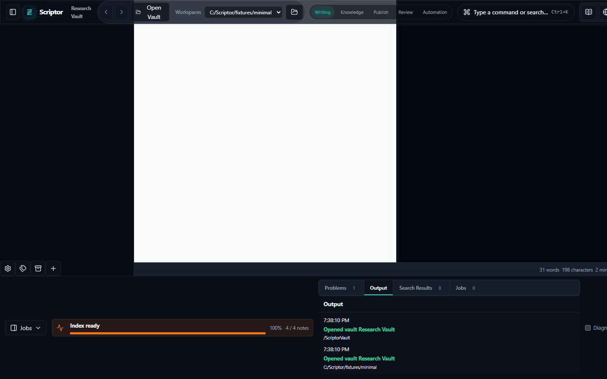
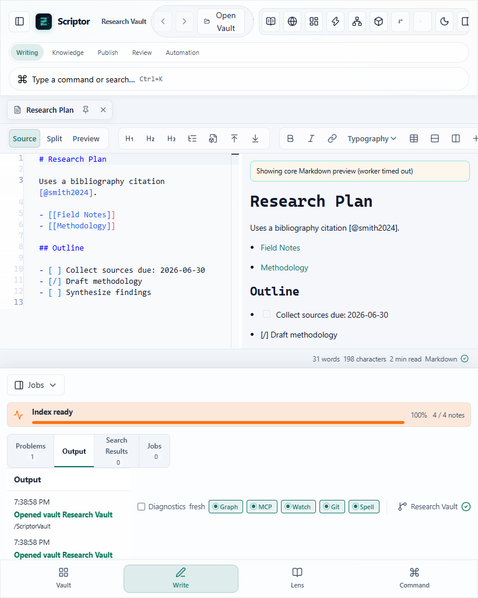
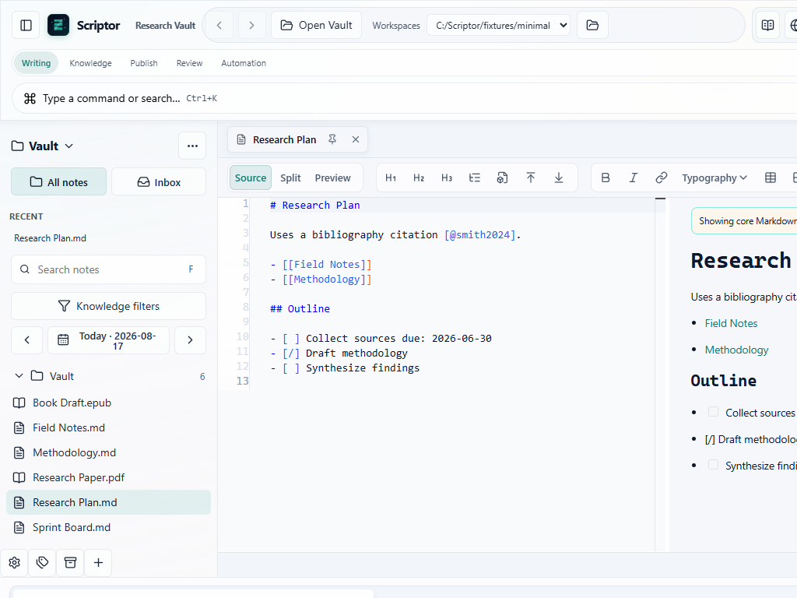

## Product surfaces

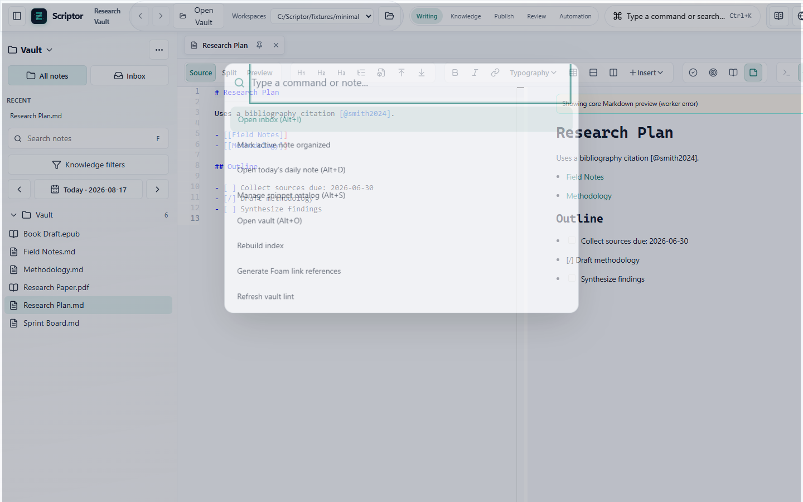
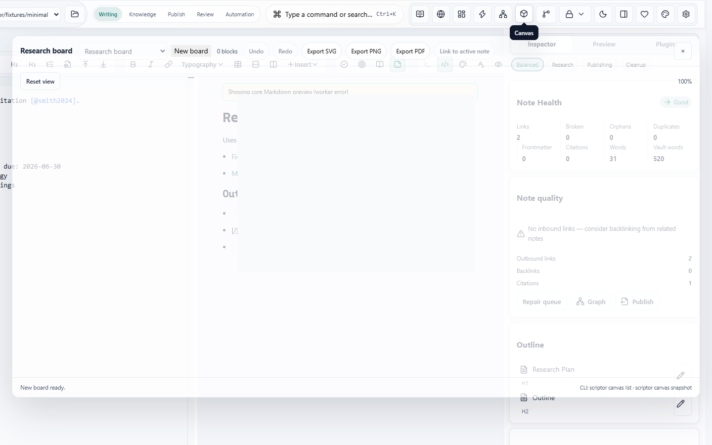

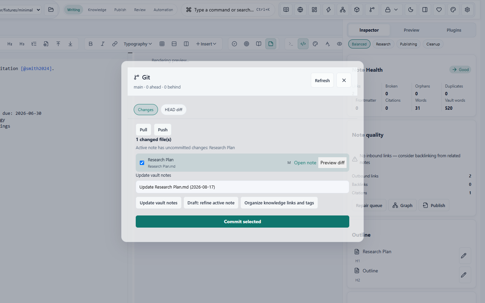
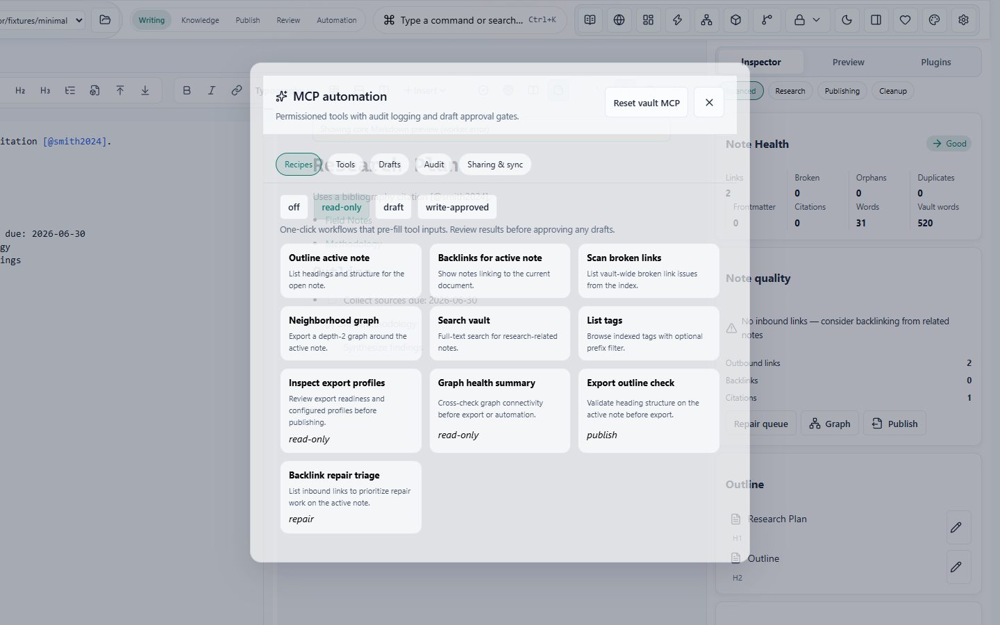

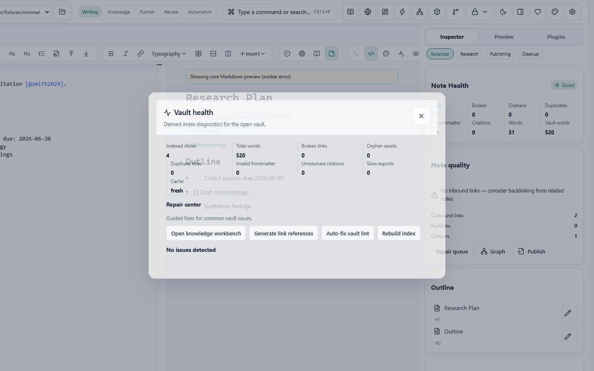

These captures are the visual index for the primary panels and widgets. The command palette is
the keyboard-first entry point; Canvas and Graph are capability-gated workspaces; Git and MCP
show transport/status surfaces; Publish and Vault health show review-before-mutation flows.

## Review states

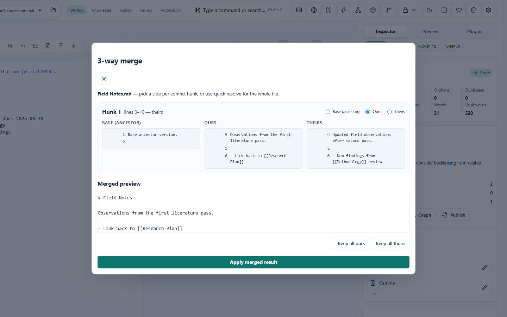
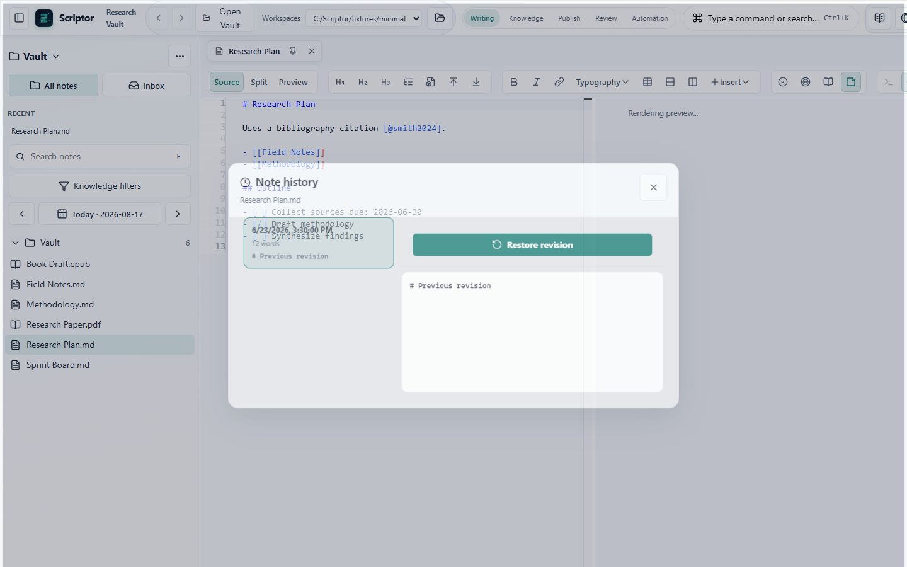
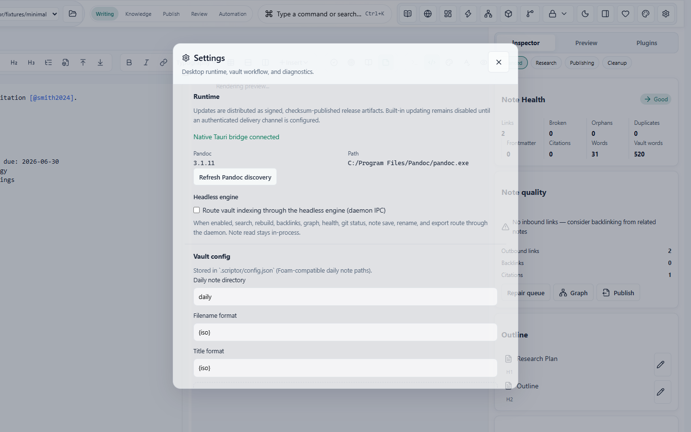

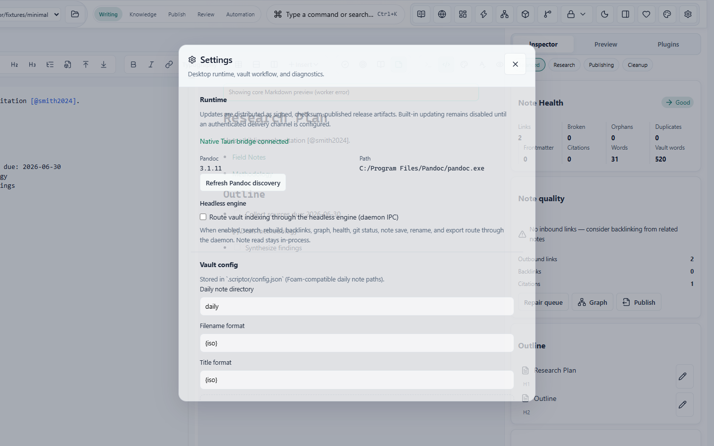
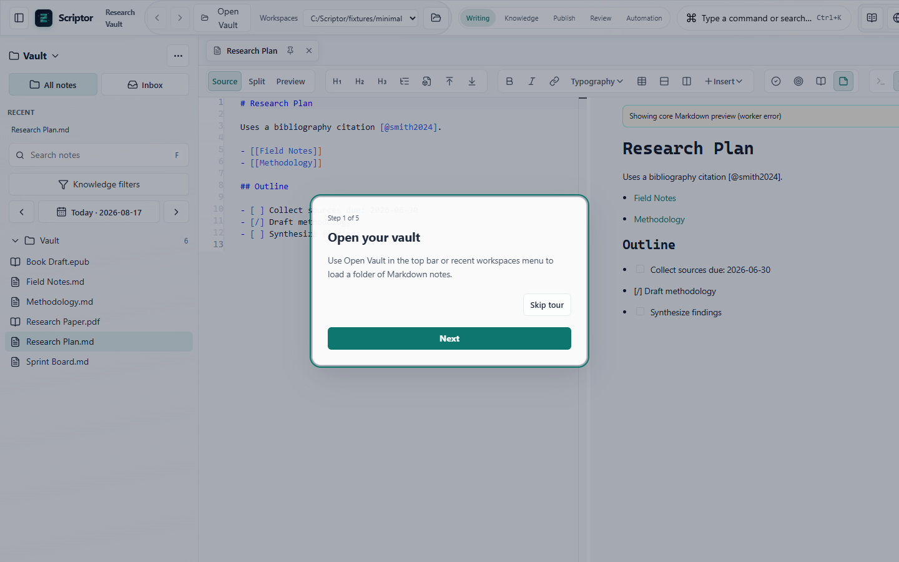

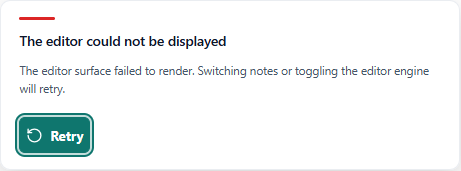
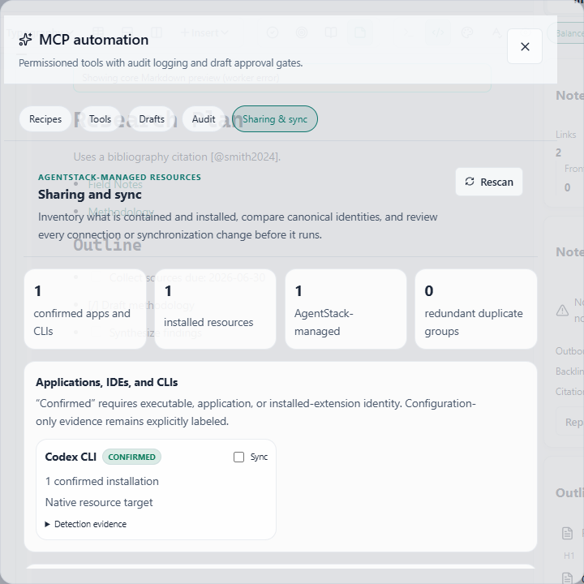

## Widgets and responsive states

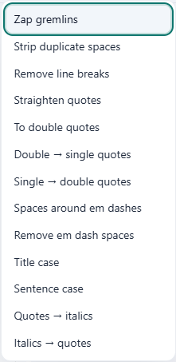
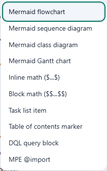
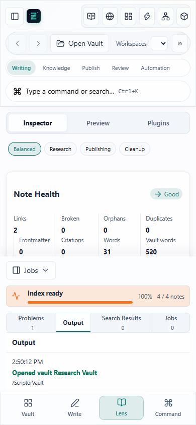
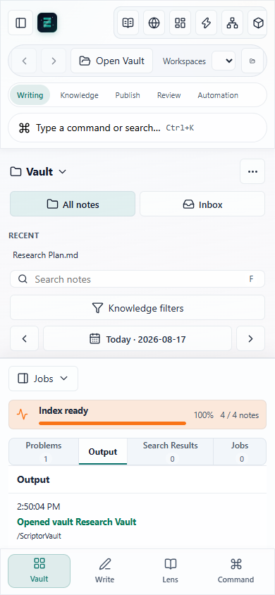

The supporting set covers knowledge navigation, reading/editing, recovery, configuration,
extension management, keyboard customization, and first-run guidance. Reader, Tasks, and Kanban
are additionally exercised by the functional Playwright regression suite; their screenshots are
captured as runtime evidence when the corresponding experimental surfaces are enabled.

The suite also covers dark mode, compact 1024/768/375px layouts, keyboard popovers, recovery
fallbacks, and indexing readiness. Any baseline change requires visual diff inspection and an
explicit review note in the change packet.
