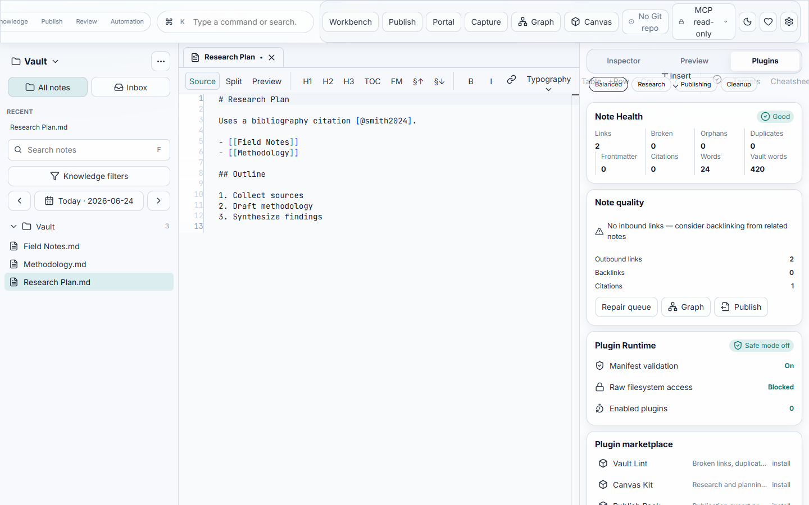

# Plugin System Design



## Goals

- Let Scriptor grow without making the core app porous.
- Keep files and vault writes protected by command contracts.
- Allow first-party and bundled marketplace extensions to add commands, renderer behavior, export profiles, MCP tools, inspector widgets, vault health checks, canvas tools, blocks, and template packs.
- Make every permission visible and revocable.

## Non-Goals

- No raw plugin filesystem access in the first version.
- No plugin-managed background daemons.
- No unreviewed MCP write tools.

## Plugin Runtime Model

```text
Plugin manifest
  -> permission review
  -> activation policy
  -> contribution registry
  -> command bus / renderer / export / MCP slots
  -> audit events
```

Plugins contribute behavior through slots:

| Slot | Capability | Permission Floor |
|---|---|---|
| Command | Command palette and automation action. | `read` |
| Renderer extension | Markdown preview transform. | `read` |
| Export profile | New export target or template. | `system` |
| MCP tool | AI/tooling interface. | `read` |
| Inspector widget | Right-panel note/vault widget. | `read` |
| Vault health check | Diagnostics rule. | `read` |
| Canvas tool | Edgeless canvas toolbar action. | `read` |
| Canvas block | Registered block renderer for canvas mode. | `read` |
| Template pack | Document or canvas starter layouts. | `read` |

## Permission Model

| Permission | Meaning |
|---|---|
| `read` | May query approved command contracts. |
| `write-approved` | May propose writes that require confirmation. |
| `system` | May use derived cache/jobs without changing canonical files. |
| `dangerous` | Requires explicit install-time warning and run-time confirmation. |
| `network` | Blocked by default, allowlisted by host. |
| `secrets` | Access only through named keychain handles. |
| `external-process` | Disabled until plugin sandbox policy exists. |

## First-Party Plugin Candidates

| Plugin | Value | Slots |
|---|---|---|
| `scriptor-citation-tools` | CSL, bibliography, missing citation health checks. | inspector widget, health check, export profile |
| `scriptor-graph-lens` | Advanced graph filters and note centrality reports. | inspector widget, command |
| `scriptor-publish-pack` | Publication templates and export profiles. | export profile, renderer extension |
| `scriptor-vault-lint` | Rules for broken links, invalid frontmatter, stale notes. | health check, command |
| `scriptor-mcp-research` | Read-only research assistant tools. | MCP tool, command |
| `scriptor-canvas-kit` | Sticky notes, shapes, connectors, and research board templates. | canvas tool, canvas block, template pack |

## Safety Gates

- Plugin manifests are schema-validated before load.
- Permission changes require user confirmation.
- Plugin commands route through the same command bus as UI and CLI.
- Plugin widgets receive scoped data, never raw vault handles.
- Plugin renderer extensions receive sanitized extension inputs.
- Plugin failures disable the plugin without crashing the app shell.
- Safe mode starts with all plugins disabled.

## Shipped capabilities

| Capability | Location |
|---|---|
| Manifest schema | `@scriptor/core/contracts/plugin` |
| Contribution registry + safe mode | `packages/plugin-api` |
| Bundled marketplace catalog | `packages/plugin-api/catalog.json`, `src/marketplace.ts` |
| Remote catalog merge | `loadMarketplaceCatalog` (`VITE_SCRIPTOR_PLUGIN_MARKETPLACE_URL`) |
| First-party plugins | `scriptor-vault-lint`, `scriptor-canvas-kit`, `scriptor-publish-pack` |
| Plugin panel UI | `src/components/PluginPanel.tsx` |
| MCP read-only plugin slot | `packages/mcp` |

