# Container-Diagramm Ebene 2 — Scriptor-Architektur

[English](c4-container.md) · [简体中文](c4-container.zh-CN.md) · [Русский](c4-container.ru.md) · **Deutsch** · [Español](c4-container.es.md) · [فارسی](c4-container.fa.md)

**Status:** aktuelles Container-Modell der Implementierung. Tantivy, Embeddings, WASM, der Rust-Citation-Engine-Prototyp und der reine Bibliotheks-Zotero-Connector sind bewusst nicht Teil dieses Runtime-Diagramms, da sie nur der Evaluation dienen.

## Container-Übersicht

```mermaid
C4Container
    title Scriptor-Runtime-Container

    Person(user, "Nutzer / Autor", "Besitzt den lokalen Markdown-Vault.")

    System_Boundary(scriptor, "Scriptor") {
        Container(renderer, "React Renderer", "React 19 / TypeScript / Vite", "Workspace-UI, Editor-Komposition, Review-Oberflächen und typisierte Bridge-Adapter.")
        Container(native, "Tauri Native Shell", "Rust / Tauri 2", "Native Command Adapter, einmaliger Authorization Broker und Desktop Composition Root.")
        Container(vault, "Vault Kernel", "scriptor-vault", "Sichere Pfade, Markdown-/Config-Autorität, atomare Änderungen, Scans, Watcher und Recovery.")
        Container(indexer, "Indexer / Knowledge Engine", "scriptor-indexer / SQLite FTS5", "Abgeleiteter Note/Link/Tag/Task/Citation-Index, BM25-Suche, Graph- und DQL-Abfragen.")
        Container(git, "Native Git Service", "scriptor-native-git + system git", "Status/Diff/Commit/Conflict/Pull/Push mit serialisierten Desktop-Mutationen.")
        Container(exporter, "Export Runner", "scriptor-export-runner", "Exportprofile, Preflight und lokale Tool-Orchestrierung.")
        Container(publisher, "Publish Runner", "scriptor-publish-runner", "Frontmatter-gesteuerter lokaler Starlight-Plan/Review/Apply und verwalteter Zustand.")
        Container(canvas, "Canvas Engine", "scriptor-canvas-engine", "Canvas-Dokumentmodell und räumliche Operationen.")
        Container(system_bridge, "System Bridge", "scriptor-system-bridge", "Keychain, begrenzte Prozessrichtlinie und OS-Integration.")
        Container(daemon, "Local Daemon", "scriptor-daemon", "Authentifiziertes lokales RPC-Command-Gateway, Event Stream, Jobs und native MCP-stdio-Oberfläche.")
        Container(ipc, "Daemon IPC Contracts", "scriptor-ipc / postcard", "Typisierte, versionierte und begrenzte Daemon-Request/Response/Event-Envelopes.")
        Container(cli, "CLI / TUI", "scriptor-cli", "Terminaloberfläche für Nutzer/Operatoren; unterstützte Runtime-Arbeit läuft über den Daemon.")
    }

    SystemDb_Ext(vault_files, "Vault Files", "Markdown/assets", "Maßgebliche Nutzerdaten")
    SystemDb_Ext(index_db, "Derived Index", "SQLite WAL / FTS5", "Wiederaufbaubarer Such- und Graph-Zustand")
    System_Ext(git_remote, "Git Remote", "Optionales Git-Hosting")
    System_Ext(external_tools, "Local Export Tools", "Pandoc / Typst und zugelassene Binärdateien")
    System_Ext(network_apis, "Opt-in Network APIs", "AI Provider und Google Calendar/Tasks")

    Rel(user, renderer, "Nutzt Desktop-UI")
    Rel(user, cli, "Nutzt Terminal-UI/-Befehle")
    Rel(renderer, native, "Ruft typed desktop bridge auf", "Tauri invoke")
    Rel(native, vault, "Liest/ändert Notes/Config", "in-process Rust")
    Rel(native, indexer, "Fragt ab/baut Derived Index neu", "in-process Rust")
    Rel(native, git, "Git commands", "in-process Rust")
    Rel(native, exporter, "Export jobs", "in-process Rust")
    Rel(native, publisher, "Plan/apply local publish", "in-process Rust")
    Rel(native, canvas, "Canvas operations", "in-process Rust")
    Rel(native, system_bridge, "Keychain / geregelte OS actions", "in-process Rust")
    Rel(cli, daemon, "Authenticated RPC", "local socket + scriptor-ipc")
    Rel(daemon, ipc, "Serialisiert command/event envelopes", "postcard")
    Rel(daemon, vault, "Vault operations", "in-process Rust")
    Rel(daemon, indexer, "Search/graph/index operations", "in-process Rust")
    Rel(daemon, git, "Git operations", "in-process Rust")
    Rel(vault, vault_files, "Maßgebliche Lese-/Schreibzugriffe")
    Rel(indexer, vault_files, "Liest Markdown für Rebuild/Incremental Indexing")
    Rel(indexer, index_db, "Liest/schreibt Derived State")
    Rel(git, git_remote, "Push/pull", "system git / Nutzer-HTTPS- oder SSH-Konfiguration")
    Rel(exporter, external_tools, "Führt explizite Export-Toolchain aus", "bounded subprocess")
    Rel(native, network_apis, "Explizite opt-in Integration Calls", "native HTTPS")
```

## Container-Grenzen

| Container | Eigentum und wichtige Invarianten |
|---|---|
| React renderer | Nur Presentation/Review; Production-Native-Calls liegen unter `src/bridge/`; keine direkte Secret-Autorität. |
| Tauri native shell | Validiert Command-Payloads und Scopes; risikoreiche Operationen verbrauchen frische Native Grants. |
| Vault kernel | Kanonische Filesystem-/Path-Autorität, atomare Writes, begrenzte Scans, Recovery/History. |
| Indexer | Wiederaufbaubarer SQLite WAL/FTS5 Cache; FTS5 Body Snippets und korrekt ausgerichtete BM25-Gewichte. |
| Git service | System-Git läuft nichtinteraktiv; Desktop-Mutationen werden durch Application State serialisiert; wiederverwendbare Queue ist begrenzt. |
| Export runner | Explizite Exportprofile und lokale Prozessgrenzen; externe Tools sind nicht die Vault-Autorität. |
| Publish runner | Renderer wählt nur aus einem vom Publish Runner abgeleiteten Plan; Apply berechnet Eligibility/Hash neu, schreibt atomar und löscht nur verwaltete, nachweislich veraltete Orphans. |
| Canvas engine | Lokaler Canvas-Zustand und räumliche Operationen; keine unabhängige Netzwerkautorität. |
| System bridge | Keychain-/Process-/OS-Grenze mit Redaction, Allowlists, Zeit-/Ausgabegrenzen und Cancellation. |
| Daemon + IPC | Authentifizierter Same-User-Transport, Endpoint-Nonce bei jedem Request und Event Subscription, begrenzte Frames/Queues sowie resynchronisierende Event-Auslieferung. |
| CLI/TUI | Terminaladapter; maschinenlesbare Ausgabe, wo unterstützt, und kein versteckter direkter Daten-Bypass für Daemon-geroutete Befehle. |

## Persistenz

- Markdown-Vault und Nutzer-Assets: maßgeblich.
- `.scriptor/cache/index.sqlite`: abgeleiteter/wiederaufbaubarer Search/Graph/Task/Citation-Zustand.
- `.scriptor/reader/annotations.json`, Recovery-/Audit-Sidecars und Konfiguration: lokaler Anwendungszustand mit Path-/Atomic-Write-Kontrollen.
- lokale Publish-Ausgabe und `.scriptor-publish-state.json`: generierter/verwalteter Zustand außerhalb des Vaults; niemals maßgeblich für Quellnotizen.
