# Diagrama de contenedores de nivel 2 — Arquitectura de Scriptor

[English](c4-container.md) · [简体中文](c4-container.zh-CN.md) · [Русский](c4-container.ru.md) · [Deutsch](c4-container.de.md) · **Español** · [فارسی](c4-container.fa.md)

**Estado:** modelo de contenedores de la implementación actual. Tantivy, embeddings, WASM, el prototipo Rust citation-engine y el connector Zotero que solo existe como librería quedan intencionadamente fuera de este diagrama de runtime porque son superficies de evaluación.

## Resumen de contenedores

```mermaid
C4Container
    title Contenedores de runtime de Scriptor

    Person(user, "Usuario / Autor", "Es propietario del vault Markdown local.")

    System_Boundary(scriptor, "Scriptor") {
        Container(renderer, "React Renderer", "React 19 / TypeScript / Vite", "UI del workspace, composición del editor, superficies de review y adaptadores bridge tipados.")
        Container(native, "Tauri Native Shell", "Rust / Tauri 2", "Adaptadores de comandos nativos, authorization broker de un solo uso y composition root de escritorio.")
        Container(vault, "Vault Kernel", "scriptor-vault", "Rutas seguras, autoridad Markdown/config, mutación atómica, scanning, watcher y recovery.")
        Container(indexer, "Indexer / Knowledge Engine", "scriptor-indexer / SQLite FTS5", "Índice derivado de note/link/tag/task/citation, búsqueda BM25, graph y consultas DQL.")
        Container(git, "Native Git Service", "scriptor-native-git + system git", "Status/diff/commit/conflict/pull/push con mutaciones de escritorio serializadas.")
        Container(exporter, "Export Runner", "scriptor-export-runner", "Perfiles de exportación, preflight y orquestación de herramientas locales.")
        Container(publisher, "Publish Runner", "scriptor-publish-runner", "Plan/review/apply local de Starlight condicionado por frontmatter y estado gestionado.")
        Container(canvas, "Canvas Engine", "scriptor-canvas-engine", "Modelo de documento Canvas y operaciones espaciales.")
        Container(system_bridge, "System Bridge", "scriptor-system-bridge", "Keychain, política de procesos acotada e integración con el SO.")
        Container(daemon, "Local Daemon", "scriptor-daemon", "Gateway RPC local autenticado, event stream, jobs y superficie MCP stdio nativa.")
        Container(ipc, "Daemon IPC Contracts", "scriptor-ipc / postcard", "Envelopes daemon request/response/event tipados, versionados y acotados.")
        Container(cli, "CLI / TUI", "scriptor-cli", "Superficie terminal de usuario/operador; enruta el trabajo runtime soportado a través del daemon.")
    }

    SystemDb_Ext(vault_files, "Vault Files", "Markdown/assets", "Datos de usuario autoritativos")
    SystemDb_Ext(index_db, "Derived Index", "SQLite WAL / FTS5", "Estado reconstruible de búsqueda y graph")
    System_Ext(git_remote, "Git Remote", "Hosting Git opcional")
    System_Ext(external_tools, "Local Export Tools", "Pandoc / Typst y binarios aprobados")
    System_Ext(network_apis, "Opt-in Network APIs", "AI provider y Google Calendar/Tasks")

    Rel(user, renderer, "Usa la UI de escritorio")
    Rel(user, cli, "Usa terminal UI/comandos")
    Rel(renderer, native, "Invoca typed desktop bridge", "Tauri invoke")
    Rel(native, vault, "Lee/modifica notes/config", "in-process Rust")
    Rel(native, indexer, "Consulta/reconstruye derived index", "in-process Rust")
    Rel(native, git, "Git commands", "in-process Rust")
    Rel(native, exporter, "Export jobs", "in-process Rust")
    Rel(native, publisher, "Plan/apply local publish", "in-process Rust")
    Rel(native, canvas, "Canvas operations", "in-process Rust")
    Rel(native, system_bridge, "Keychain / acciones de SO gobernadas", "in-process Rust")
    Rel(cli, daemon, "Authenticated RPC", "local socket + scriptor-ipc")
    Rel(daemon, ipc, "Serializa command/event envelopes", "postcard")
    Rel(daemon, vault, "Vault operations", "in-process Rust")
    Rel(daemon, indexer, "Search/graph/index operations", "in-process Rust")
    Rel(daemon, git, "Git operations", "in-process Rust")
    Rel(vault, vault_files, "Lecturas/escrituras autoritativas")
    Rel(indexer, vault_files, "Lee Markdown para rebuild/incremental indexing")
    Rel(indexer, index_db, "Lee/escribe derived state")
    Rel(git, git_remote, "Push/pull", "system git / configuración HTTPS o SSH del usuario")
    Rel(exporter, external_tools, "Ejecuta la toolchain explícita de exportación", "bounded subprocess")
    Rel(native, network_apis, "Llamadas explícitas opt-in de integración", "native HTTPS")
```

## Fronteras de los contenedores

| Contenedor | Propiedad e invariantes importantes |
|---|---|
| React renderer | Solo presentación/review; las llamadas nativas de producción viven bajo `src/bridge/`; no tiene autoridad directa sobre secrets. |
| Tauri native shell | Valida command payloads y scopes; las operaciones de alto impacto consumen grants nativos recientes. |
| Vault kernel | Autoridad canónica de filesystem/path, escrituras atómicas, scans acotados, recovery/history. |
| Indexer | Cache SQLite WAL/FTS5 reconstruible; snippets FTS5 de cuerpo y pesos BM25 correctamente alineados. |
| Git service | system-git se ejecuta de forma no interactiva; las mutaciones de escritorio se serializan mediante el estado de la aplicación; la cola reutilizable está acotada. |
| Export runner | Perfiles explícitos de exportación y fronteras de procesos locales; las herramientas externas no son la autoridad del vault. |
| Publish runner | Renderer solo selecciona desde un plan derivado por publish-runner; apply recalcula eligibility/hash, escribe atómicamente y elimina únicamente orphans gestionados y confirmados como obsoletos. |
| Canvas engine | Estado local de Canvas y operaciones espaciales; sin autoridad de red independiente. |
| System bridge | Frontera keychain/process/OS con redaction, allowlists, límites de tiempo/salida y cancelación. |
| Daemon + IPC | Transporte local autenticado para el mismo usuario, nonce por endpoint en cada request y event subscription, frames/queues acotados y entrega de eventos con resincronización. |
| CLI/TUI | Adaptador de terminal; salida machine-readable donde se admite y sin bypass oculto directo de datos para comandos enrutados por daemon. |

## Persistencia

- Vault Markdown y assets del usuario: autoritativos.
- `.scriptor/cache/index.sqlite`: estado derivado/reconstruible de search/graph/task/citation.
- `.scriptor/reader/annotations.json`, sidecars de recovery/audit y configuración: estado local de la aplicación con controles de path/atomic-write.
- salida local de publish y `.scriptor-publish-state.json`: estado generado/gestionado fuera del vault; nunca autoritativo para las notas fuente.
