```mermaid
C4Container
    title Containerهای runtime در Scriptor

    Person(user, "کاربر / نویسنده", "مالک vault محلی Markdown است.")

    System_Boundary(scriptor, "Scriptor") {
        Container(renderer, "React Renderer", "React 19 / TypeScript / Vite", "UI فضای کاری، ترکیب editor، سطوح review و adapterهای typed bridge.")
        Container(native, "Tauri Native Shell", "Rust / Tauri 2", "adapterهای command بومی، authorization broker یک‌بارمصرف و composition root دسکتاپ.")
        Container(vault, "Vault Kernel", "scriptor-vault", "مسیرهای امن، authority مربوط به Markdown/config، mutation اتمیک، scanning، watcher و recovery.")
        Container(indexer, "Indexer / Knowledge Engine", "scriptor-indexer / SQLite FTS5", "index مشتق note/link/tag/task/citation، جست‌وجوی BM25، graph و queryهای DQL.")
        Container(git, "Native Git Service", "scriptor-native-git + system git", "status/diff/commit/conflict/pull/push با mutationهای دسکتاپ سریال‌شده.")
        Container(exporter, "Export Runner", "scriptor-export-runner", "profileهای export، preflight و orchestration ابزارهای محلی.")
        Container(publisher, "Publish Runner", "scriptor-publish-runner", "plan/review/apply محلی Starlight که با frontmatter محدود می‌شود و state مدیریت‌شده.")
        Container(canvas, "Canvas Engine", "scriptor-canvas-engine", "مدل سند Canvas و عملیات مکانی.")
        Container(system_bridge, "System Bridge", "scriptor-system-bridge", "Keychain، policy محدود process و integration سیستم‌عامل.")
        Container(daemon, "Local Daemon", "scriptor-daemon", "gateway محلی RPC با احراز اصالت، event stream، jobها و سطح native MCP stdio.")
        Container(ipc, "Daemon IPC Contracts", "scriptor-ipc / postcard", "envelopeهای typed، versioned و bounded برای request/response/event daemon.")
        Container(cli, "CLI / TUI", "scriptor-cli", "سطح terminal برای کاربر/اپراتور؛ کار runtime پشتیبانی‌شده را از daemon عبور می‌دهد.")
    }

    SystemDb_Ext(vault_files, "Vault Files", "Markdown/assets", "داده مرجع کاربر")
    SystemDb_Ext(index_db, "Derived Index", "SQLite WAL / FTS5", "state قابل بازسازی search و graph")
    System_Ext(git_remote, "Git Remote", "میزبانی اختیاری Git")
    System_Ext(external_tools, "Local Export Tools", "Pandoc / Typst و binaryهای تأییدشده")
    System_Ext(network_apis, "Opt-in Network APIs", "AI provider و Google Calendar/Tasks")

    Rel(user, renderer, "از desktop UI استفاده می‌کند")
    Rel(user, cli, "از terminal UI/commands استفاده می‌کند")
    Rel(renderer, native, "typed desktop bridge را فراخوانی می‌کند", "Tauri invoke")
    Rel(native, vault, "notes/config را می‌خواند/تغییر می‌دهد", "in-process Rust")
    Rel(native, indexer, "derived index را query/rebuild می‌کند", "in-process Rust")
    Rel(native, git, "Git commands", "in-process Rust")
    Rel(native, exporter, "Export jobs", "in-process Rust")
    Rel(native, publisher, "Plan/apply local publish", "in-process Rust")
    Rel(native, canvas, "Canvas operations", "in-process Rust")
    Rel(native, system_bridge, "Keychain / OS actions کنترل‌شده", "in-process Rust")
    Rel(cli, daemon, "Authenticated RPC", "local socket + scriptor-ipc")
    Rel(daemon, ipc, "command/event envelopes را serialize می‌کند", "postcard")
    Rel(daemon, vault, "Vault operations", "in-process Rust")
    Rel(daemon, indexer, "Search/graph/index operations", "in-process Rust")
    Rel(daemon, git, "Git operations", "in-process Rust")
    Rel(vault, vault_files, "خواندن/نوشتن مرجع")
    Rel(indexer, vault_files, "Markdown را برای rebuild/incremental indexing می‌خواند")
    Rel(indexer, index_db, "derived state را می‌خواند/می‌نویسد")
    Rel(git, git_remote, "Push/pull", "system git / پیکربندی HTTPS یا SSH کاربر")
    Rel(exporter, external_tools, "export toolchain صریح را اجرا می‌کند", "bounded subprocess")
    Rel(native, network_apis, "integration call صریح opt-in", "native HTTPS")
```

[English](c4-container.md) · **فارسی** · [简体中文](c4-container.zh-CN.md) · [Русский](c4-container.ru.md) · [Deutsch](c4-container.de.md) · [Español](c4-container.es.md)

# نمودار <bdi dir="ltr">Container</bdi> سطح ۲ — معماری <bdi dir="ltr">Scriptor</bdi>

[<bdi dir="ltr">English</bdi>](c4-container.md) · [简体中文](c4-container.zh-CN.md) · [Русский](c4-container.ru.md) · [<bdi dir="ltr">Deutsch</bdi>](c4-container.de.md) · [<bdi dir="ltr">Espa</bdi>ñ<bdi dir="ltr">ol</bdi>](c4-container.es.md) · **فارسی**

**وضعیت:** مدل <bdi dir="ltr">container</bdi> مربوط به پیاده‌سازی فعلی. <bdi dir="ltr">Tantivy</bdi>، <bdi dir="ltr">embeddings</bdi>، <bdi dir="ltr">WASM</bdi>، <bdi dir="ltr">prototype</bdi> موتور <bdi dir="ltr">citation</bdi> در <bdi dir="ltr">Rust</bdi> و <bdi dir="ltr">connector</bdi> کتابخانه‌ای <bdi dir="ltr">Zotero</bdi> که فقط برای ارزیابی هستند عمداً خارج از این نمودار <bdi dir="ltr">runtime</bdi> قرار دارند.

## نمای کلی <bdi dir="ltr">Container</bdi>ها

## مرزهای <bdi dir="ltr">Container</bdi>

| <bdi dir="ltr">Container</bdi> | مالکیت و <bdi dir="ltr">invariant</bdi>های مهم |
|---|---|
| <bdi dir="ltr">React renderer</bdi> | فقط <bdi dir="ltr">presentation/review</bdi>؛ فراخوانی‌های <bdi dir="ltr">native</bdi> در <bdi dir="ltr">production</bdi> زیر <bdi dir="ltr">`src/bridge/`</bdi> هستند؛ دسترسی مستقیم به <bdi dir="ltr">secret</bdi> ندارد. |
| <bdi dir="ltr">Tauri native shell</bdi> | <bdi dir="ltr">command payload</bdi> و <bdi dir="ltr">scope</bdi> را اعتبارسنجی می‌کند؛ عملیات پراثر <bdi dir="ltr">grant</bdi> بومی تازه مصرف می‌کنند. |
| <bdi dir="ltr">Vault kernel</bdi> | <bdi dir="ltr">authority</bdi> مرجع <bdi dir="ltr">filesystem/path</bdi>، نوشتن اتمیک، <bdi dir="ltr">scan</bdi> محدود و <bdi dir="ltr">recovery/history.</bdi> |
| <bdi dir="ltr">Indexer</bdi> | <bdi dir="ltr">cache</bdi> قابل بازسازی <bdi dir="ltr">SQLite WAL/FTS5</bdi>؛ <bdi dir="ltr">snippet</bdi>های <bdi dir="ltr">body</bdi> در <bdi dir="ltr">FTS5</bdi> و <bdi dir="ltr">weight</bdi>های <bdi dir="ltr">BM25</bdi> با <bdi dir="ltr">alignment</bdi> درست. |
| <bdi dir="ltr">Git service</bdi> | <bdi dir="ltr">system-git</bdi> به‌صورت <bdi dir="ltr">noninteractive</bdi> اجرا می‌شود؛ <bdi dir="ltr">mutation</bdi>های دسکتاپ از طریق <bdi dir="ltr">application state</bdi> سریال می‌شوند؛ <bdi dir="ltr">queue</bdi> قابل‌استفاده مجدد محدود است. |
| <bdi dir="ltr">Export runner</bdi> | <bdi dir="ltr">profile</bdi>های صریح <bdi dir="ltr">export</bdi> و مرزهای <bdi dir="ltr">local process</bdi>؛ ابزار خارجی <bdi dir="ltr">authority</bdi> مربوط به <bdi dir="ltr">vault</bdi> نیست. |
| <bdi dir="ltr">Publish runner</bdi> | <bdi dir="ltr">renderer</bdi> فقط از <bdi dir="ltr">plan</bdi> ساخته‌شده توسط <bdi dir="ltr">publish-runner</bdi> انتخاب می‌کند؛ <bdi dir="ltr">apply</bdi> دوباره <bdi dir="ltr">eligibility/hash</bdi> را محاسبه می‌کند، اتمیک می‌نویسد و فقط <bdi dir="ltr">orphan</bdi>های مدیریت‌شده و واقعاً <bdi dir="ltr">stale</bdi> را حذف می‌کند. |
| <bdi dir="ltr">Canvas engine</bdi> | <bdi dir="ltr">state</bdi> محلی <bdi dir="ltr">Canvas</bdi> و عملیات مکانی؛ <bdi dir="ltr">authority</bdi> مستقل شبکه ندارد. |
| <bdi dir="ltr">System bridge</bdi> | مرز <bdi dir="ltr">keychain/process/OS</bdi> با <bdi dir="ltr">redaction</bdi>، <bdi dir="ltr">allowlist</bdi>، محدودیت <bdi dir="ltr">time/output</bdi> و <bdi dir="ltr">cancellation.</bdi> |
| <bdi dir="ltr">Daemon</bdi> + <bdi dir="ltr">IPC</bdi> | <bdi dir="ltr">local transport</bdi> با احراز اصالت برای همان کاربر؛ <bdi dir="ltr">nonce</bdi> مربوط به <bdi dir="ltr">endpoint</bdi> در هر <bdi dir="ltr">request</bdi> و <bdi dir="ltr">event subscription</bdi>، <bdi dir="ltr">frame/queue</bdi> محدود و تحویل <bdi dir="ltr">event</bdi> با <bdi dir="ltr">resynchronization.</bdi> |
| <bdi dir="ltr">CLI/TUI</bdi> | <bdi dir="ltr">adapter</bdi> ترمینال؛ در صورت پشتیبانی خروجی <bdi dir="ltr">machine-readable</bdi> و بدون <bdi dir="ltr">bypass</bdi> مخفی داده برای <bdi dir="ltr">command</bdi>های <bdi dir="ltr">route</bdi>شده از <bdi dir="ltr">daemon.</bdi> |

## ماندگاری

- <bdi dir="ltr">vault</bdi> <bdi dir="ltr">Markdown</bdi> و <bdi dir="ltr">asset</bdi>های کاربر: مرجع اصلی.
- <bdi dir="ltr">`.scriptor/cache/index.sqlite`</bdi>: <bdi dir="ltr">state</bdi> مشتق و قابل بازسازی <bdi dir="ltr">search/graph/task/citation.</bdi>
- <bdi dir="ltr">`.scriptor/reader/annotations.json`</bdi>، <bdi dir="ltr">sidecar</bdi>های <bdi dir="ltr">recovery/audit</bdi> و <bdi dir="ltr">configuration: state</bdi> محلی برنامه با کنترل <bdi dir="ltr">path/atomic-write.</bdi>
- خروجی <bdi dir="ltr">local publish</bdi> و <bdi dir="ltr">`.scriptor-publish-state.json`</bdi>: <bdi dir="ltr">state</bdi> تولیدشده/مدیریت‌شده خارج از <bdi dir="ltr">vault</bdi>؛ هرگز برای <bdi dir="ltr">source note</bdi>ها مرجع نیست.

