```mermaid
C4Container
    title Containerهای runtime در Scriptor

    Person(user, "کاربر / نویسنده", "مالک vault محلی Markdown است.")

    System_Boundary(scriptor, "Scriptor") {
        Container(renderer, "React Renderer", "React 19 / TypeScript / Vite", "UI فضای کاری، ترکیب editor، سطوح review و adapterهای typed bridge.")
        Container(native, "Tauri Native Shell", "Rust / Tauri 2", "adapterهای command بومی، authorization broker یک‌بارمصرف و composition root دسکتاپ.")
        Container(vault, "Vault Kernel", "scriptor-vault", "مسیرهای امن، authority مربوط به Markdown/config، mutation اتمیک، scanning، watcher و recovery.")
        Container(indexer, "Indexer / Knowledge Engine", "scriptor-indexer / SQLite FTS5", "index مشتق note/link/tag/task/citation، جست‌وجوی BM25، graph و queryهای DQL.")
        Container(git, "Native Git Service", "scriptor-native-git + system git", "status/diff/commit/conflict/pull/push با mutationهای دسکتاپ سریال‌شده.")
        Container(exporter, "Export Runner", "scriptor-export-runner", "profileهای export، preflight و orchestration ابزارهای محلی.")
        Container(publisher, "Publish Runner", "scriptor-publish-runner", "plan/review/apply محلی Starlight که با frontmatter محدود می‌شود و state مدیریت‌شده.")
        Container(canvas, "Canvas Engine", "scriptor-canvas-engine", "مدل سند Canvas و عملیات مکانی.")
        Container(system_bridge, "System Bridge", "scriptor-system-bridge", "Keychain، policy محدود process و integration سیستم‌عامل.")
        Container(daemon, "Local Daemon", "scriptor-daemon", "gateway محلی RPC با احراز اصالت، event stream، jobها و سطح native MCP stdio.")
        Container(ipc, "Daemon IPC Contracts", "scriptor-ipc / postcard", "envelopeهای typed، versioned و bounded برای request/response/event daemon.")
        Container(cli, "CLI / TUI", "scriptor-cli", "سطح terminal برای کاربر/اپراتور؛ کار runtime پشتیبانی‌شده را از daemon عبور می‌دهد.")
    }

    SystemDb_Ext(vault_files, "Vault Files", "Markdown/assets", "داده مرجع کاربر")
    SystemDb_Ext(index_db, "Derived Index", "SQLite WAL / FTS5", "state قابل بازسازی search و graph")
    System_Ext(git_remote, "Git Remote", "میزبانی اختیاری Git")
    System_Ext(external_tools, "Local Export Tools", "Pandoc / Typst و binaryهای تأییدشده")
    System_Ext(network_apis, "Opt-in Network APIs", "AI provider و Google Calendar/Tasks")

    Rel(user, renderer, "از desktop UI استفاده می‌کند")
    Rel(user, cli, "از terminal UI/commands استفاده می‌کند")
    Rel(renderer, native, "typed desktop bridge را فراخوانی می‌کند", "Tauri invoke")
    Rel(native, vault, "notes/config را می‌خواند/تغییر می‌دهد", "in-process Rust")
    Rel(native, indexer, "derived index را query/rebuild می‌کند", "in-process Rust")
    Rel(native, git, "Git commands", "in-process Rust")
    Rel(native, exporter, "Export jobs", "in-process Rust")
    Rel(native, publisher, "Plan/apply local publish", "in-process Rust")
    Rel(native, canvas, "Canvas operations", "in-process Rust")
    Rel(native, system_bridge, "Keychain / OS actions کنترل‌شده", "in-process Rust")
    Rel(cli, daemon, "Authenticated RPC", "local socket + scriptor-ipc")
    Rel(daemon, ipc, "command/event envelopes را serialize می‌کند", "postcard")
    Rel(daemon, vault, "Vault operations", "in-process Rust")
    Rel(daemon, indexer, "Search/graph/index operations", "in-process Rust")
    Rel(daemon, git, "Git operations", "in-process Rust")
    Rel(vault, vault_files, "خواندن/نوشتن مرجع")
    Rel(indexer, vault_files, "Markdown را برای rebuild/incremental indexing می‌خواند")
    Rel(indexer, index_db, "derived state را می‌خواند/می‌نویسد")
    Rel(git, git_remote, "Push/pull", "system git / پیکربندی HTTPS یا SSH کاربر")
    Rel(exporter, external_tools, "export toolchain صریح را اجرا می‌کند", "bounded subprocess")
    Rel(native, network_apis, "integration call صریح opt-in", "native HTTPS")
```

# نمودار Container سطح ۲ — معماری Scriptor

[English](c4-container.md) · [简体中文](c4-container.zh-CN.md) · [Русский](c4-container.ru.md) · [Deutsch](c4-container.de.md) · [Español](c4-container.es.md) · **فارسی**

**وضعیت:** مدل container مربوط به پیاده‌سازی فعلی. Tantivy، embeddings، WASM، prototype موتور citation در Rust و connector کتابخانه‌ای Zotero که فقط برای ارزیابی هستند عمداً خارج از این نمودار runtime قرار دارند.

## نمای کلی Containerها

## مرزهای Container

| Container | مالکیت و invariantهای مهم |
|---|---|
| React renderer | فقط presentation/review؛ فراخوانی‌های native در production زیر <bdi dir="ltr">`src/bridge/`</bdi> هستند؛ دسترسی مستقیم به secret ندارد. |
| Tauri native shell | command payload و scope را اعتبارسنجی می‌کند؛ عملیات پراثر grant بومی تازه مصرف می‌کنند. |
| Vault kernel | authority مرجع filesystem/path، نوشتن اتمیک، scan محدود و recovery/history. |
| Indexer | cache قابل بازسازی SQLite WAL/FTS5؛ snippetهای body در FTS5 و weightهای BM25 با alignment درست. |
| Git service | system-git به‌صورت noninteractive اجرا می‌شود؛ mutationهای دسکتاپ از طریق application state سریال می‌شوند؛ queue قابل‌استفاده مجدد محدود است. |
| Export runner | profileهای صریح export و مرزهای local process؛ ابزار خارجی authority مربوط به vault نیست. |
| Publish runner | renderer فقط از plan ساخته‌شده توسط publish-runner انتخاب می‌کند؛ apply دوباره eligibility/hash را محاسبه می‌کند، اتمیک می‌نویسد و فقط orphanهای مدیریت‌شده و واقعاً stale را حذف می‌کند. |
| Canvas engine | state محلی Canvas و عملیات مکانی؛ authority مستقل شبکه ندارد. |
| System bridge | مرز keychain/process/OS با redaction، allowlist، محدودیت time/output و cancellation. |
| Daemon + IPC | local transport با احراز اصالت برای همان کاربر؛ nonce مربوط به endpoint در هر request و event subscription، frame/queue محدود و تحویل event با resynchronization. |
| CLI/TUI | adapter ترمینال؛ در صورت پشتیبانی خروجی machine-readable و بدون bypass مخفی داده برای commandهای routeشده از daemon. |

## ماندگاری

- vault Markdown و assetهای کاربر: مرجع اصلی.
- <bdi dir="ltr">`.scriptor/cache/index.sqlite`</bdi>: state مشتق و قابل بازسازی search/graph/task/citation.
- <bdi dir="ltr">`.scriptor/reader/annotations.json`</bdi>، sidecarهای recovery/audit و configuration: state محلی برنامه با کنترل path/atomic-write.
- خروجی local publish و <bdi dir="ltr">`.scriptor-publish-state.json`</bdi>: state تولیدشده/مدیریت‌شده خارج از vault؛ هرگز برای source noteها مرجع نیست.

