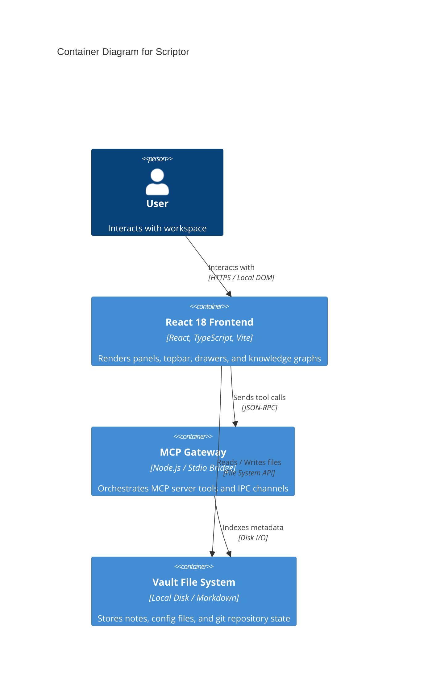

# Container & Component Diagram (C4 Level 2)

## Container Specification
- **Frontend SPA**: React 18, TypeScript, Tailwind v4, Vite. Renders the interactive workspace, handles state colocation, and manages WCAG-compliant UI shells.
- **MCP Gateway Container**: Manages connection pools, tool registration, and RPC invocations for registered Model Context Protocol tools.
- **Local Storage / Vault Container**: Manages markdown files, metadata caches, and IndexedDB state persistence.

## Container Diagram

