# Level 2 Container Diagram — Scriptor Architecture

**Status:** current implementation container model. Evaluation-only Tantivy, embeddings, WASM, the Rust citation-engine prototype, and the library-only Zotero connector are intentionally outside this runtime diagram.

## Container overview

```mermaid
C4Container
    title Scriptor runtime containers

    Person(user, "User / Author", "Owns the local Markdown vault.")

    System_Boundary(scriptor, "Scriptor") {
        Container(renderer, "React Renderer", "React 19 / TypeScript / Vite", "Workspace UI, editor composition, review surfaces and typed bridge adapters.")
        Container(native, "Tauri Native Shell", "Rust / Tauri 2", "Native command adapters, one-time authorization broker and desktop composition root.")
        Container(vault, "Vault Kernel", "scriptor-vault", "Safe paths, Markdown/config authority, atomic mutation, scanning, watcher and recovery.")
        Container(indexer, "Indexer / Knowledge Engine", "scriptor-indexer / SQLite FTS5", "Derived note/link/tag/task/citation index, BM25 search, graph and DQL queries.")
        Container(git, "Native Git Service", "scriptor-native-git + system git", "Status/diff/commit/conflict/pull/push with serialized desktop mutations.")
        Container(exporter, "Export Runner", "scriptor-export-runner", "Export profiles, preflight and local tool orchestration.")
        Container(publisher, "Publish Runner", "scriptor-publish-runner", "Frontmatter-gated local Starlight plan/review/apply and managed state.")
        Container(canvas, "Canvas Engine", "scriptor-canvas-engine", "Canvas document model and spatial operations.")
        Container(system_bridge, "System Bridge", "scriptor-system-bridge", "Keychain, bounded process policy and OS integration.")
        Container(daemon, "Local Daemon", "scriptor-daemon", "Authenticated local RPC command gateway, event stream, jobs and native MCP stdio surface.")
        Container(ipc, "Daemon IPC Contracts", "scriptor-ipc / postcard", "Typed, versioned, bounded daemon request/response/event envelopes.")
        Container(cli, "CLI / TUI", "scriptor-cli", "User/operator terminal surface; routes supported runtime work through the daemon.")
    }

    SystemDb_Ext(vault_files, "Vault Files", "Markdown/assets", "Authoritative user data")
    SystemDb_Ext(index_db, "Derived Index", "SQLite WAL / FTS5", "Rebuildable search and graph state")
    System_Ext(git_remote, "Git Remote", "Optional Git hosting")
    System_Ext(external_tools, "Local Export Tools", "Pandoc / Typst and approved binaries")
    System_Ext(network_apis, "Opt-in Network APIs", "AI provider and Google Calendar/Tasks")

    Rel(user, renderer, "Uses desktop UI")
    Rel(user, cli, "Uses terminal UI/commands")
    Rel(renderer, native, "Invokes typed desktop bridge", "Tauri invoke")
    Rel(native, vault, "Reads/mutates notes/config", "in-process Rust")
    Rel(native, indexer, "Queries/rebuilds derived index", "in-process Rust")
    Rel(native, git, "Git commands", "in-process Rust")
    Rel(native, exporter, "Export jobs", "in-process Rust")
    Rel(native, publisher, "Plan/apply local publish", "in-process Rust")
    Rel(native, canvas, "Canvas operations", "in-process Rust")
    Rel(native, system_bridge, "Keychain / governed OS actions", "in-process Rust")
    Rel(cli, daemon, "Authenticated RPC", "local socket + scriptor-ipc")
    Rel(daemon, ipc, "Serializes command/event envelopes", "postcard")
    Rel(daemon, vault, "Vault operations", "in-process Rust")
    Rel(daemon, indexer, "Search/graph/index operations", "in-process Rust")
    Rel(daemon, git, "Git operations", "in-process Rust")
    Rel(vault, vault_files, "Authoritative reads/writes")
    Rel(indexer, vault_files, "Reads Markdown for rebuild/incremental indexing")
    Rel(indexer, index_db, "Reads/writes derived state")
    Rel(git, git_remote, "Push/pull", "system git / user HTTPS or SSH config")
    Rel(exporter, external_tools, "Runs explicit export toolchain", "bounded subprocess")
    Rel(native, network_apis, "Explicit opt-in integration calls", "native HTTPS")
```

## Container boundaries

| Container | Ownership and important invariants |
|---|---|
| React renderer | Presentation/review only; production native calls live under `src/bridge/`; no raw secret authority. |
| Tauri native shell | Validates command payloads and scopes; high-impact operations consume fresh native grants. |
| Vault kernel | Canonical filesystem/path authority, atomic writes, bounded scans, recovery/history. |
| Indexer | Rebuildable SQLite WAL/FTS5 cache; FTS5 body snippets and correctly aligned BM25 weights. |
| Git service | System-git execution is noninteractive; desktop mutations serialize through application state; reusable queue is bounded. |
| Export runner | Explicit export profiles and local process boundaries; external tools are not the vault authority. |
| Publish runner | Renderer selects only from a server-derived plan; apply recomputes eligibility/hash, writes atomically and deletes only managed fresh orphans. |
| Canvas engine | Local canvas state and spatial operations; no independent network authority. |
| System bridge | Keychain/process/OS boundary with redaction, allowlists, time/output bounds and cancellation. |
| Daemon + IPC | Same-user authenticated local transport, nonce on production connections, bounded frames/queues and resynchronizing event delivery. |
| CLI/TUI | Terminal adapter; machine-readable output where supported and no hidden direct-data bypass for daemon-routed commands. |

## Persistence

- Markdown vault and user assets: authoritative.
- `.scriptor/cache/index.sqlite`: derived/rebuildable search/graph/task/citation state.
- `.scriptor/reader/annotations.json`, recovery/audit sidecars and configuration: local application state with path/atomic-write controls.
- local publish output and `.scriptor-publish-state.json`: generated/managed state outside the vault; never authoritative for source notes.
