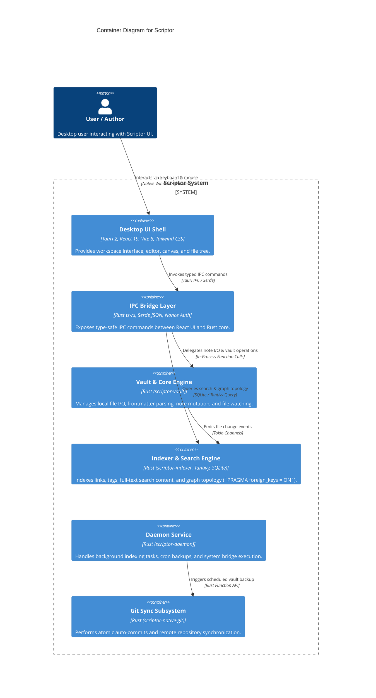

# C4 Model Specification: Level 2 Containers for Scriptor

> **Specification Standard:** C4 Model Level 2 Container Diagram (`architecture-c4-model`) for Scriptor (`D:\GitHub\Scriptor`).

## 1. Container Architecture

Scriptor is structured as a hybrid desktop application combining a **Tauri 2 Native Desktop Shell**, a **React 19 Frontend SPA Monorepo**, and a suite of high-performance **Rust Engine Crates**.

---

## 2. Container Diagram

---

## 3. Container Specifications

| Container | Tech Stack | Responsibility | Key Interfaces |
|---|---|---|---|
| **Desktop UI Shell** | React 19, Vite 8, Radix UI, Lucide | User interface, markdown editor, canvas views, modals. | Tauri IPC `@tauri-apps/api` |
| **IPC Bridge Layer** | Rust `scriptor-ipc`, `ts-rs` | Serializes/deserializes TypeScript types to Rust structs. | `tsconfig.contracts.json` |
| **Vault & Core Engine** | Rust 1.96, Tokio, `thiserror` | Vault file CRUD, frontmatter YAML parsing, atomic writes. | `scriptor-vault` Rust Crate |
| **Indexer & Search** | Rust, SQLite (`rusqlite`), Tantivy | SQLite relational link graph (`PRAGMA foreign_keys = ON`), Tantivy FTS index. | SQLite DB & Tantivy Index |
| **Daemon Service** | Rust `scriptor-daemon` | Background worker queue, scheduled jobs, process bridge. | IPC Nonce Channel |
| **Git Engine** | Rust `scriptor-native-git`, `git2` | Atomic Git commits, staging, branch management, git push/pull. | libgit2 C Bindings |
