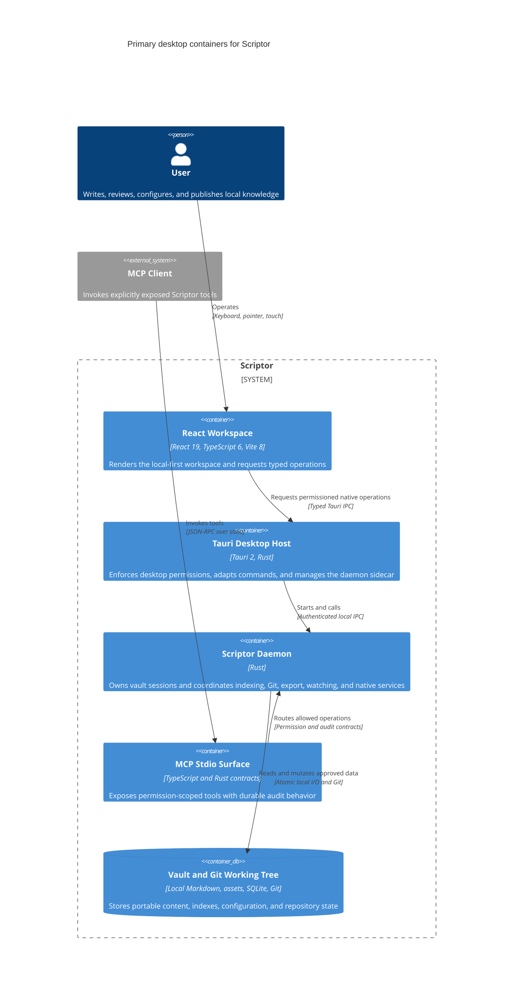

# Container diagram (C4 level 2)

This view presents Tauri desktop as the primary supported product surface. The headless daemon, CLI, TUI, and MCP are supported operational surfaces that reuse selected Rust and TypeScript packages with their own process boundaries. Mobile remains experimental or design-only and is not represented as sharing the desktop or headless deployment boundaries.

## Containers

- **React workspace:** React 19, TypeScript 6, and Vite 8 render the editor, panels, graph, canvas, and review surfaces. The renderer does not receive unrestricted native authority.
- **Tauri desktop host:** Tauri 2 packages the desktop application, exposes permissioned Rust command adapters, and manages the bundled daemon sidecar.
- **Scriptor daemon and Rust kernel:** The authenticated local daemon owns vault sessions and routes indexing, Git, export, file-watching, and other native operations through Rust crates.
- **MCP stdio surface:** Permission-scoped MCP schemas and runners expose read, draft, and approval-gated operations with audit records.
- **Vault and Git working tree:** Portable Markdown, configuration, assets, indexes, and repository metadata remain on local disk.

## Diagram

## Source references

- `package.json`
- `apps/desktop/README.md`
- `docs/architecture/IPC_DAEMON.md`
- `packages/mcp/README.md`
- `PRODUCT.md`
