# Level 2 Container Diagram — Scriptor Architecture

**Target:** `D:\GitHub\Scriptor`  
**System:** Scriptor Local-First Markdown Workspace  
**Specification:** Level 2 Container Model (C4 Architecture Standard)  
**Date:** 2026-08-09  

---

## 1. Container Overview

The Level 2 Container Model breaks down the **Scriptor Desktop System** into its core runtime containers, showing the high-level technology choices, data flows, and communication boundaries between desktop UI, Rust backend engine crates, SQLite/Tantivy persistence, daemon services, and process isolation sandboxes.

```mermaid
C4Container
    title Complete Level 2 Container Diagram for Scriptor

    Person(user, "User / Author", "Desktop author interacting with Scriptor workspace.")

    System_Boundary(scriptor_boundary, "Scriptor Desktop System") {
        Container(desktop_ui, "Desktop UI Shell", "Tauri 2, React 19, Vite 8, Tailwind CSS", "Renders workspace editor, spatial canvas, reference manager, and graph view.")
        Container(ipc_layer, "IPC Bridge Layer", "Rust scriptor-ipc, ts-rs, Serde", "Serializes and routes type-safe IPC calls between UI and Rust engine crates.")
        Container(vault_engine, "Vault Core Engine", "Rust scriptor-vault", "Handles file I/O, frontmatter YAML parsing, atomic writes, and file watching.")
        Container(indexer_engine, "Indexer & Search Engine", "Rust scriptor-indexer, SQLite, Tantivy", "Indexes link graph, tags, FTS5 note text, and citation references.")
        Container(citation_engine, "Citation Engine", "Rust scriptor-citation-engine, citationberg", "Parses Zotero CSL JSON/BibTeX libraries and formats citations.")
        Container(export_runner, "Export Runner Engine", "Rust scriptor-export-runner, Typst", "Orchestrates headless PDF/HTML exports and document compilation.")
        Container(canvas_engine, "Canvas Spatial Engine", "Rust scriptor-canvas-engine", "Processes .canvas JSON graph layouts, spatial indexing, and hit-testing.")
        Container(system_bridge, "System Execution Bridge", "Rust scriptor-system-bridge", "Enforces authorized process launch isolation and OS integration policy.")
        Container(daemon_ipc, "Daemon Worker Service", "Rust scriptor-daemon", "Executes background indexing queues, cron backups, and system jobs.")
        Container(git_engine, "Git Sync Subsystem", "Rust scriptor-native-git, libgit2", "Performs atomic auto-commits, staging, and remote Git pushes.")
    }

    System_Ext(zotero, "Zotero / CSL Storage", "Local CSL JSON & BibTeX bibliography databases.")
    System_Ext(pdf_engine, "PDF / Typst Binaries", "Headless compilation tools (Typst, Pandoc, Chromium).")
    System_Ext(git_remotes, "Git Remote Server", "GitHub / GitLab / Gitea remote repositories.")

    Rel(user, desktop_ui, "Interacts via GUI", "Native Webview")
    Rel(desktop_ui, ipc_layer, "Invokes IPC commands", "Tauri IPC / Serde")
    Rel(ipc_layer, vault_engine, "Note CRUD & File IO", "In-Process Call")
    Rel(ipc_layer, indexer_engine, "Search & Graph queries", "SQLite / FTS5")
    Rel(ipc_layer, citation_engine, "Citation formatting & BibTeX", "In-Process Call")
    Rel(ipc_layer, export_runner, "PDF/HTML export requests", "In-Process Call")
    Rel(ipc_layer, canvas_engine, "Spatial hit-testing & routing", "In-Process Call")
    Rel(ipc_layer, system_bridge, "Authorized system actions", "In-Process Call")
    Rel(vault_engine, indexer_engine, "Emits note change events", "Tokio Channel")
    Rel(vault_engine, canvas_engine, "Reads/writes .canvas files", "Tokio Channel")
    Rel(citation_engine, zotero, "Reads CSL JSON / BibTeX", "Local Disk Read")
    Rel(export_runner, pdf_engine, "Delegates compilation", "Subprocess Sandbox")
    Rel(daemon_ipc, git_engine, "Triggers background sync", "Rust Function API")
    Rel(daemon_ipc, system_bridge, "Delegates CLI tasks", "Rust Function API")
    Rel(git_engine, git_remotes, "Pushes / pulls branches", "HTTPS / SSH")
```

---

## 2. Container Inventory & Subsystem Matrix

| Container Name | Crate / Technology | Primary Responsibilities | Security & Performance Guarantees |
|---|---|---|---|
| **Desktop UI Shell** | `src/`, `apps/desktop`, React 19, Vite 8 | User interface, CodeMirror 6 editor, Spatial canvas, Graph visualization, Settings pane. | Monospace data, `tabular-nums`, 44px touch targets, zero AI slop defaults. |
| **IPC Bridge Layer** | `crates/ipc` (`scriptor-ipc`) | Serializes `RpcRequest` and `RpcResponse` structs via `postcard` framing and `ts-rs` exports. | 8-byte magic header (`ARCL`), 16MB frame limit, zero-copy borrowed deserialization. |
| **Vault Core Engine** | `crates/vault` (`scriptor-vault`) | Manages note CRUD, atomic writes, recovery backups (`.bak`), YAML frontmatter, and file watchers. | Zero unwrap in prod paths, strict path normalization (`RelativeVaultPath`). |
| **Indexer Engine** | `crates/indexer` (`scriptor-indexer`) | SQLite FTS5 full-text search, BM25 scoring, link graph BFS traversal, and tag indexing. | `PRAGMA foreign_keys = ON`, `journal_mode = WAL`, `busy_timeout = 5000ms`, FTS5 parameter escaping. |
| **Citation Engine** | `crates/citation-engine` | CSL JSON parsing, BibTeX extraction, and `citationberg` formatted citation generation. | Patched `citationberg` (`06a591e2f237d25e1dfdedac3f3d1494c496c52d`) for safe XML parsing. |
| **Export Runner Engine** | `crates/export-runner` | Pandoc `--citeproc` flag composition, Typst compilation, and PDF/HTML export rendering. | Disallowed flags allowlist, path traversal rejection (`..`), trusted binary SHA256 checks. |
| **Canvas Spatial Engine** | `crates/canvas-engine` | `.canvas` JSON parsing, spatial hit-testing, node bounds intersection, and CRDT LWW state merge. | Canvas hit-test sorting (`sort_by_key` with `Reverse`), WebWorker layout offloading. |
| **System Execution Bridge** | `crates/system-bridge` | Subprocess launch isolation (`bwrap` on Linux, `sandbox-exec` SBPL on macOS), system info query. | Network policy denial (`Deny`), SBPL string escaping (`\`, `"`, `\n`, `\r`), process inventory check. |
| **Daemon Worker Service** | `crates/daemon` (`scriptor-daemon`) | Local RPC server over Unix domain sockets / named pipes, background index rebuild, cron jobs. | HMAC header authentication, rate-limiting token bucket, socket lock cleanup. |
| **Git Sync Subsystem** | `crates/native-git` | Porcelain status parsing, atomic 3-way conflict resolution, commit staging, and remote push. | Pathspec escaping, marker-free conflict resolution, zero-panic parser bounds. |
