# Диаграмма контейнеров уровня 2 — архитектура Scriptor

[English](c4-container.md) · [简体中文](c4-container.zh-CN.md) · **Русский** · [Deutsch](c4-container.de.md) · [Español](c4-container.es.md) · [فارسی](c4-container.fa.md)

**Статус:** текущая модель контейнеров реализации. Tantivy, embeddings, WASM, прототип Rust citation-engine и библиотечный Zotero connector, предназначенные только для оценки, намеренно не включены в эту runtime-диаграмму.

## Обзор контейнеров

```mermaid
C4Container
    title Runtime-контейнеры Scriptor

    Person(user, "Пользователь / Автор", "Владеет локальным Markdown vault.")

    System_Boundary(scriptor, "Scriptor") {
        Container(renderer, "React Renderer", "React 19 / TypeScript / Vite", "UI рабочего пространства, композиция редактора, поверхности review и типизированные bridge-adapters.")
        Container(native, "Tauri Native Shell", "Rust / Tauri 2", "Native command adapters, одноразовый authorization broker и composition root десктопа.")
        Container(vault, "Vault Kernel", "scriptor-vault", "Безопасные пути, authority Markdown/config, атомарные изменения, сканирование, watcher и recovery.")
        Container(indexer, "Indexer / Knowledge Engine", "scriptor-indexer / SQLite FTS5", "Производный индекс note/link/tag/task/citation, BM25 search, graph и DQL queries.")
        Container(git, "Native Git Service", "scriptor-native-git + system git", "Status/diff/commit/conflict/pull/push с сериализацией desktop-изменений.")
        Container(exporter, "Export Runner", "scriptor-export-runner", "Export profiles, preflight и оркестрация локальных инструментов.")
        Container(publisher, "Publish Runner", "scriptor-publish-runner", "Frontmatter-gated локальный Starlight plan/review/apply и управляемое состояние.")
        Container(canvas, "Canvas Engine", "scriptor-canvas-engine", "Модель Canvas-документа и пространственные операции.")
        Container(system_bridge, "System Bridge", "scriptor-system-bridge", "Keychain, ограниченная process policy и интеграция с ОС.")
        Container(daemon, "Local Daemon", "scriptor-daemon", "Аутентифицированный локальный RPC gateway, event stream, jobs и native MCP stdio surface.")
        Container(ipc, "Daemon IPC Contracts", "scriptor-ipc / postcard", "Типизированные, версионированные и ограниченные request/response/event envelopes.")
        Container(cli, "CLI / TUI", "scriptor-cli", "Терминальная поверхность пользователя/оператора; поддерживаемые runtime-операции маршрутизируются через daemon.")
    }

    SystemDb_Ext(vault_files, "Vault Files", "Markdown/assets", "Авторитетные пользовательские данные")
    SystemDb_Ext(index_db, "Derived Index", "SQLite WAL / FTS5", "Восстанавливаемое состояние search и graph")
    System_Ext(git_remote, "Git Remote", "Необязательный Git hosting")
    System_Ext(external_tools, "Local Export Tools", "Pandoc / Typst и разрешённые бинарники")
    System_Ext(network_apis, "Opt-in Network APIs", "AI provider и Google Calendar/Tasks")

    Rel(user, renderer, "Использует desktop UI")
    Rel(user, cli, "Использует terminal UI/commands")
    Rel(renderer, native, "Вызывает typed desktop bridge", "Tauri invoke")
    Rel(native, vault, "Читает/изменяет notes/config", "in-process Rust")
    Rel(native, indexer, "Запрашивает/перестраивает derived index", "in-process Rust")
    Rel(native, git, "Git commands", "in-process Rust")
    Rel(native, exporter, "Export jobs", "in-process Rust")
    Rel(native, publisher, "Plan/apply local publish", "in-process Rust")
    Rel(native, canvas, "Canvas operations", "in-process Rust")
    Rel(native, system_bridge, "Keychain / управляемые OS actions", "in-process Rust")
    Rel(cli, daemon, "Authenticated RPC", "local socket + scriptor-ipc")
    Rel(daemon, ipc, "Сериализует command/event envelopes", "postcard")
    Rel(daemon, vault, "Vault operations", "in-process Rust")
    Rel(daemon, indexer, "Search/graph/index operations", "in-process Rust")
    Rel(daemon, git, "Git operations", "in-process Rust")
    Rel(vault, vault_files, "Авторитетные чтения/записи")
    Rel(indexer, vault_files, "Читает Markdown для rebuild/incremental indexing")
    Rel(indexer, index_db, "Читает/пишет derived state")
    Rel(git, git_remote, "Push/pull", "system git / пользовательские HTTPS или SSH настройки")
    Rel(exporter, external_tools, "Запускает явную export toolchain", "bounded subprocess")
    Rel(native, network_apis, "Явные opt-in integration calls", "native HTTPS")
```

## Границы контейнеров

| Контейнер | Владение и важные инварианты |
|---|---|
| React renderer | Только presentation/review; production native calls находятся в `src/bridge/`; прямого доступа к секретам нет. |
| Tauri native shell | Валидирует command payload и scope; операции высокого риска используют свежие native grants. |
| Vault kernel | Каноническая authority файловой системы/путей, атомарные записи, ограниченные scans, recovery/history. |
| Indexer | Восстанавливаемый SQLite WAL/FTS5 cache; FTS5 body snippets и корректно выровненные BM25 weights. |
| Git service | system-git работает неинтерактивно; desktop-изменения сериализуются через состояние приложения; reusable queue ограничена. |
| Export runner | Явные export profiles и local process boundaries; внешние инструменты не являются authority vault. |
| Publish runner | Renderer выбирает только из plan, полученного от publish-runner; apply заново вычисляет eligibility/hash, пишет атомарно и удаляет только управляемые подтверждённо устаревшие orphan-файлы. |
| Canvas engine | Локальное состояние Canvas и пространственные операции; отдельной сетевой authority нет. |
| System bridge | Граница keychain/process/OS с redaction, allowlists, ограничениями времени/вывода и отменой. |
| Daemon + IPC | Аутентифицированный same-user local transport, endpoint nonce на каждом request и event subscription, ограниченные frames/queues и resynchronizing event delivery. |
| CLI/TUI | Терминальный adapter; machine-readable output, где поддерживается, без скрытого прямого обхода данных для daemon-routed commands. |

## Сохранение состояния

- Markdown vault и пользовательские assets: источник истины.
- `.scriptor/cache/index.sqlite`: восстанавливаемое производное состояние search/graph/task/citation.
- `.scriptor/reader/annotations.json`, recovery/audit sidecars и configuration: локальное состояние приложения с контролем path/atomic-write.
- локальный publish output и `.scriptor-publish-state.json`: сгенерированное/управляемое состояние вне vault; никогда не является источником истины для исходных заметок.
