# 二级容器图 — Scriptor 架构

[English](c4-container.md) · **简体中文** · [Русский](c4-container.ru.md) · [Deutsch](c4-container.de.md) · [Español](c4-container.es.md) · [فارسی](c4-container.fa.md)

**状态：** 当前实现的 container 模型。仅用于评估的 Tantivy、embeddings、WASM、Rust citation-engine 原型以及仅作为 library 的 Zotero connector 被有意排除在该 runtime 图之外。

## Container 概览

```mermaid
C4Container
    title Scriptor runtime containers

    Person(user, "用户 / 作者", "拥有本地 Markdown vault。")

    System_Boundary(scriptor, "Scriptor") {
        Container(renderer, "React Renderer", "React 19 / TypeScript / Vite", "工作区 UI、编辑器组合、review 界面和 typed bridge adapters。")
        Container(native, "Tauri Native Shell", "Rust / Tauri 2", "Native command adapters、一次性 authorization broker 与桌面 composition root。")
        Container(vault, "Vault Kernel", "scriptor-vault", "安全路径、Markdown/config 权威、原子变更、扫描、watcher 与恢复。")
        Container(indexer, "Indexer / Knowledge Engine", "scriptor-indexer / SQLite FTS5", "派生 note/link/tag/task/citation 索引、BM25 搜索、graph 与 DQL 查询。")
        Container(git, "Native Git Service", "scriptor-native-git + system git", "status/diff/commit/conflict/pull/push，并串行化桌面变更。")
        Container(exporter, "Export Runner", "scriptor-export-runner", "导出 profile、preflight 与本地工具编排。")
        Container(publisher, "Publish Runner", "scriptor-publish-runner", "受 frontmatter 约束的本地 Starlight plan/review/apply 与托管状态。")
        Container(canvas, "Canvas Engine", "scriptor-canvas-engine", "Canvas 文档模型与空间操作。")
        Container(system_bridge, "System Bridge", "scriptor-system-bridge", "Keychain、有界进程策略和操作系统集成。")
        Container(daemon, "Local Daemon", "scriptor-daemon", "经过认证的本地 RPC command gateway、event stream、job 和原生 MCP stdio 界面。")
        Container(ipc, "Daemon IPC Contracts", "scriptor-ipc / postcard", "Typed、versioned、bounded daemon request/response/event envelopes。")
        Container(cli, "CLI / TUI", "scriptor-cli", "用户/运维终端界面；通过 daemon 路由受支持的 runtime 操作。")
    }

    SystemDb_Ext(vault_files, "Vault Files", "Markdown/assets", "权威用户数据")
    SystemDb_Ext(index_db, "Derived Index", "SQLite WAL / FTS5", "可重建的搜索与 graph 状态")
    System_Ext(git_remote, "Git Remote", "可选 Git hosting")
    System_Ext(external_tools, "Local Export Tools", "Pandoc / Typst 及获准的二进制文件")
    System_Ext(network_apis, "Opt-in Network APIs", "AI provider 与 Google Calendar/Tasks")

    Rel(user, renderer, "使用桌面 UI")
    Rel(user, cli, "使用终端 UI/命令")
    Rel(renderer, native, "调用 typed desktop bridge", "Tauri invoke")
    Rel(native, vault, "读取/修改 notes/config", "in-process Rust")
    Rel(native, indexer, "查询/重建派生索引", "in-process Rust")
    Rel(native, git, "Git commands", "in-process Rust")
    Rel(native, exporter, "Export jobs", "in-process Rust")
    Rel(native, publisher, "Plan/apply 本地发布", "in-process Rust")
    Rel(native, canvas, "Canvas operations", "in-process Rust")
    Rel(native, system_bridge, "Keychain / 受治理的 OS actions", "in-process Rust")
    Rel(cli, daemon, "Authenticated RPC", "local socket + scriptor-ipc")
    Rel(daemon, ipc, "序列化 command/event envelopes", "postcard")
    Rel(daemon, vault, "Vault operations", "in-process Rust")
    Rel(daemon, indexer, "Search/graph/index operations", "in-process Rust")
    Rel(daemon, git, "Git operations", "in-process Rust")
    Rel(vault, vault_files, "权威读写")
    Rel(indexer, vault_files, "读取 Markdown 以执行重建/增量索引")
    Rel(indexer, index_db, "读写派生状态")
    Rel(git, git_remote, "Push/pull", "system git / 用户 HTTPS 或 SSH 配置")
    Rel(exporter, external_tools, "执行显式导出工具链", "bounded subprocess")
    Rel(native, network_apis, "显式 opt-in 集成调用", "native HTTPS")
```

## Container 边界

| Container | 所有权与重要不变量 |
|---|---|
| React renderer | 仅负责展示/review；production native call 位于 `src/bridge/`；无原始 secret 权限。 |
| Tauri native shell | 验证 command payload 与 scope；高影响操作消耗新的 native grant。 |
| Vault kernel | 文件系统/path 的权威层，负责原子写入、有界扫描、恢复与历史。 |
| Indexer | 可重建的 SQLite WAL/FTS5 cache；FTS5 正文 snippet 与正确对齐的 BM25 weight。 |
| Git service | system-git 非交互运行；桌面变更通过应用状态串行化；可复用队列有界。 |
| Export runner | 显式 export profile 与本地 process boundary；外部工具不是 vault 权威层。 |
| Publish runner | Renderer 只能从 publish-runner 生成的 plan 中选择；apply 会重新计算 eligibility/hash，原子写入，并只删除受管理且确认陈旧的 orphan。 |
| Canvas engine | 本地 Canvas 状态与空间操作；没有独立网络权限。 |
| System bridge | Keychain/process/OS 边界，具有 redaction、allowlist、时间/输出上限与取消。 |
| Daemon + IPC | 同用户、经认证的本地 transport；每个请求和 event subscription 都使用 endpoint nonce；frame/queue 有界，并支持重新同步事件传递。 |
| CLI/TUI | 终端 adapter；支持时提供 machine-readable 输出，不为 daemon-routed command 提供隐藏的直连数据旁路。 |

## 持久化

- Markdown vault 与用户资产：权威数据。
- `.scriptor/cache/index.sqlite`：可重建的 search/graph/task/citation 派生状态。
- `.scriptor/reader/annotations.json`、recovery/audit sidecar 与 configuration：受 path/atomic-write 控制的本地应用状态。
- 本地 publish 输出和 `.scriptor-publish-state.json`：vault 外部生成/托管状态；绝不作为源笔记的权威依据。
