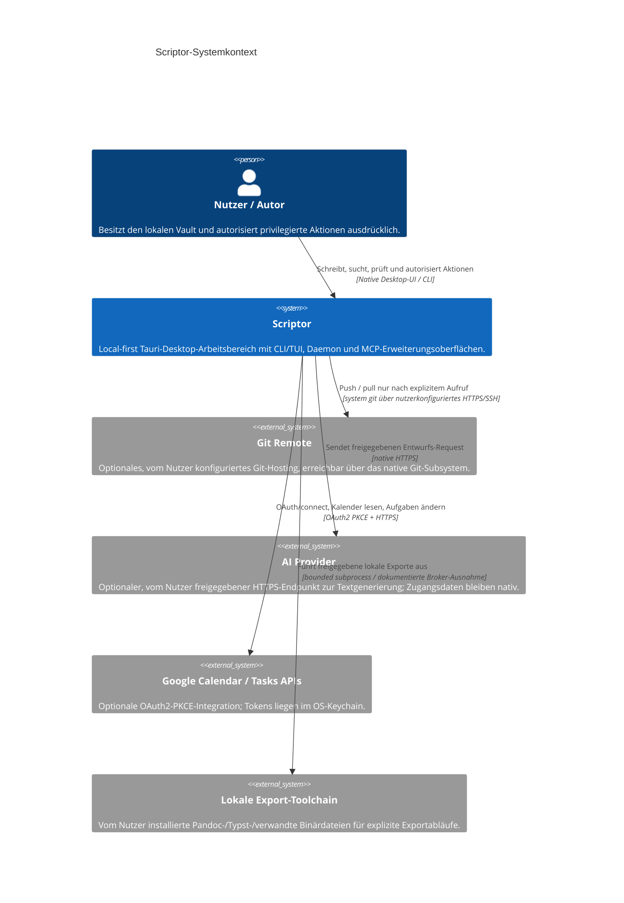

# C4-Modellspezifikation: Systemkontext Ebene 1 für Scriptor

[English](c4-context.md) · [简体中文](c4-context.zh-CN.md) · [Русский](c4-context.ru.md) · **Deutsch** · [Español](c4-context.es.md) · [فارسی](c4-context.fa.md)

**Status:** aktueller Implementierungskontext für Scriptor `1.0.0` einschließlich der noch unveröffentlichten Härtung in diesem Quellbaum. Experimentelle und ausschließlich entworfene Oberflächen werden durch [`../CAPABILITY-MATURITY.md`](../CAPABILITY-MATURITY.md) geregelt.

## Systemübersicht

Scriptor ist ein local-first Desktop-Arbeitsbereich für Wissen und Schreiben mit Markdown. Markdown im Dateisystem des Nutzers ist maßgeblich; SQLite-Indizes sowie erzeugte Publish-/Export-Artefakte sind abgeleiteter Zustand.

## Personas

| Persona | Hauptziel | Implementierte Abläufe |
|---|---|---|
| Forschende | Literaturhinweise und Entwürfe schreiben und organisieren | Markdown-Bearbeitung, lokale Bibliografie-/Zitationsprüfung, PDF-/EPUB-Lesen und Annotationen, Graph/Suche |
| Technische Redaktion | Strukturierte Dokumentation erstellen | Editor/Vorschau, Exportprofile, Git-Abläufe, geprüfte lokale Starlight-Veröffentlichung |
| Wissensarbeiter | Portable persönliche Wissensbasis pflegen | Vault-Indexierung, Volltextsuche, Backlinks/Graph, Aufgaben/Kanban, Capture |

## Systemkontext

Das Repository enthält ein read-only Zotero-Web-API-Connector-Paket, dieses ist jedoch **nicht in den ausgelieferten Desktop-/CLI-/Daemon-Runtime eingebunden** und erscheint daher nicht als aktive externe Systembeziehung.

## Vertrauensgrenzen

1. **Lokaler Vault:** Markdown und Nutzerressourcen bleiben auf dem Datenträger maßgeblich. Abgeleitete Indizes und Publish-Ausgaben sind wiederherstellbar.
2. **Renderer/Native-Grenze:** Der Renderer erhält keine Datei-, Keychain-, Git-, Netzwerk-, Prozess-, Backup- oder Publish-Autorität. Native Code validiert Pfade, Payloads und sensible Grants erneut.
3. **Daemon-Grenze:** CLI/TUI und Daemon-MCP verwenden das typisierte lokale `scriptor-ipc`-Protokoll mit authentifizierten Endpoint-Metadaten, Nonce-Prüfungen und begrenztem Framing. Diese Grenze ist von Tauri Renderer IPC getrennt.
4. **Externe Prozesse:** Unterstützte Starts laufen über den Process Broker, sofern nicht eine eng begrenzte, dokumentierte Ausnahme gleichwertige Limits und Richtlinien übernimmt.
5. **Externes Netzwerk:** Git-, AI- und Google-Integrationen sind opt-in und verwenden integrationsspezifische Authentifizierung. Es gibt keinen impliziten Netzwerk-Fallback.
