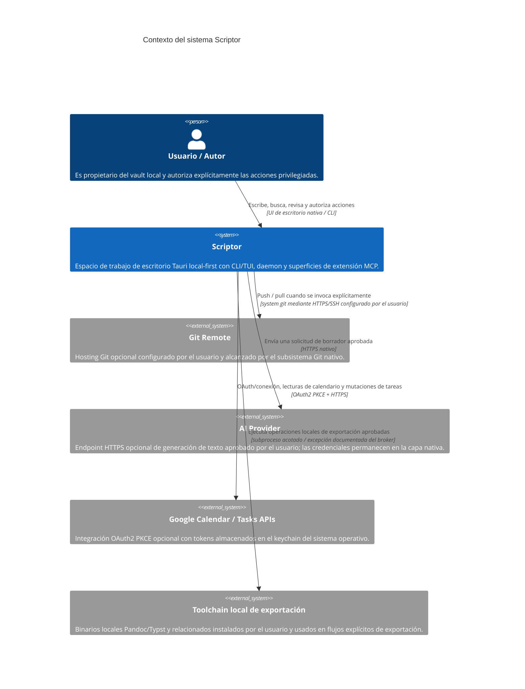

# Especificación del modelo C4: contexto del sistema de nivel 1 de Scriptor

[English](c4-context.md) · [简体中文](c4-context.zh-CN.md) · [Русский](c4-context.ru.md) · [Deutsch](c4-context.de.md) · **Español** · [فارسی](c4-context.fa.md)

**Estado:** contexto de la implementación actual de Scriptor `1.0.0`, junto con el endurecimiento aún no publicado en este árbol. Las superficies experimentales y solo de diseño se rigen por [`../CAPABILITY-MATURITY.md`](../CAPABILITY-MATURITY.md).

## Resumen del sistema

Scriptor es un espacio de trabajo de escritorio local-first para conocimiento y escritura en Markdown. El Markdown del sistema de archivos del usuario es la fuente de verdad; los índices SQLite y los artefactos generados de publicación/exportación son estado derivado.

## Personas

| Persona | Objetivo principal | Flujos implementados |
|---|---|---|
| Investigador | Escribir y organizar notas bibliográficas y borradores | Edición Markdown, inspección local de bibliografía/citas, lectura y anotaciones PDF/EPUB, grafo/búsqueda |
| Redactor técnico | Producir documentación estructurada | Editor/vista previa, perfiles de exportación, flujos Git, publicación local Starlight revisada |
| Trabajador del conocimiento | Mantener una base de conocimiento personal y portable | Indexado del vault, búsqueda de texto completo, backlinks/grafo, tareas/Kanban, captura |

## Contexto del sistema

El repositorio contiene un paquete connector de solo lectura para Zotero Web API, pero **no está integrado en el runtime desktop/CLI/daemon distribuido** y por tanto no se representa como una relación activa con un sistema externo.

## Fronteras de confianza

1. **Vault local:** Markdown y los recursos del usuario siguen siendo autoritativos en disco. Los índices derivados y la salida de publicación son reconstruibles.
2. **Frontera renderer/native:** el renderer no recibe autoridad sobre filesystem, keychain, Git, red, procesos, backups o publicación. El código nativo vuelve a validar rutas, payloads y grants sensibles.
3. **Frontera daemon:** CLI/TUI y daemon MCP usan el protocolo local tipado `scriptor-ipc` con metadatos de endpoint autenticados, comprobaciones nonce y framing acotado. Es distinto del IPC del renderer Tauri.
4. **Procesos externos:** los lanzamientos soportados pasan por el process broker, salvo excepciones estrechas y documentadas que mantengan límites y política equivalentes.
5. **Red externa:** las integraciones Git, AI y Google son opt-in y usan autenticación específica. No existe fallback de red ambiental.
