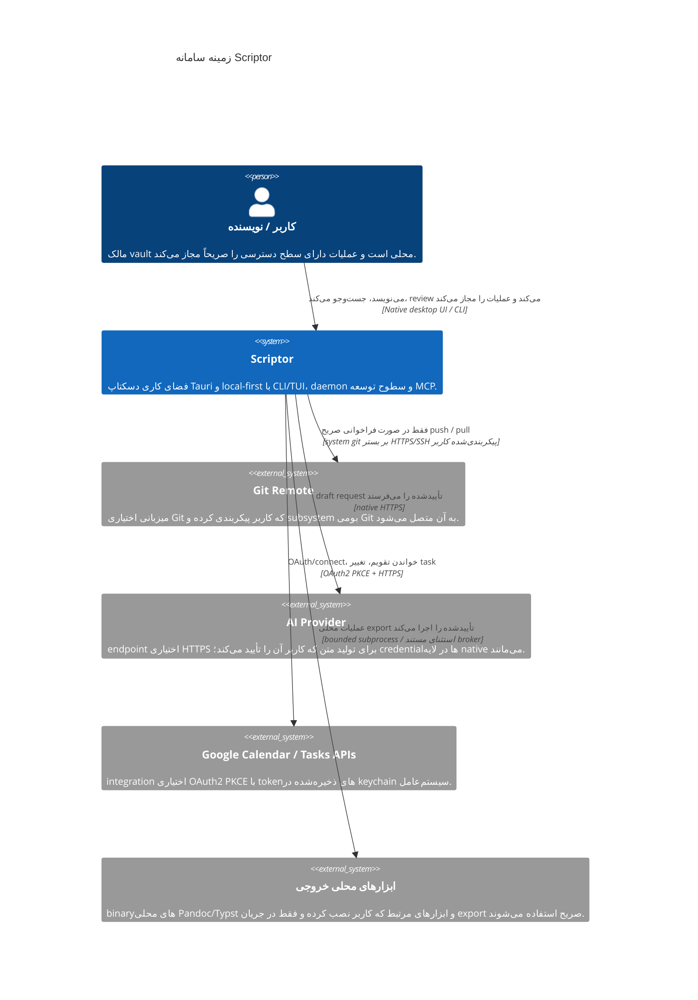

[English](c4-context.md) · **فارسی** · [简体中文](c4-context.zh-CN.md) · [Русский](c4-context.ru.md) · [Deutsch](c4-context.de.md) · [Español](c4-context.es.md)

# مشخصات مدل C4: زمینه سامانه Scriptor در سطح ۱

[English](c4-context.md) · [简体中文](c4-context.zh-CN.md) · [Русский](c4-context.ru.md) · [Deutsch](c4-context.de.md) · [Español](c4-context.es.md) · **فارسی**

**وضعیت:** زمینه پیاده‌سازی فعلی Scriptor <bdi dir="ltr">`1.0.0`</bdi> به‌همراه سخت‌سازی‌های هنوز منتشرنشده در این tree. سطوح آزمایشی و صرفاً طراحی‌شده تابع [`../CAPABILITY-MATURITY.md`](../CAPABILITY-MATURITY.md) هستند.

## نمای کلی سامانه

<bdi dir="ltr">Scriptor</bdi> یک فضای کاری دسکتاپ local-first برای دانش و نوشتن با Markdown است. Markdown موجود در filesystem کاربر مرجع اصلی است؛ indexهای SQLite و artifactهای تولیدشده برای publish/export حالت مشتق‌شده‌اند.

## پرسوناها

| پرسونا | هدف اصلی | گردش‌کارهای پیاده‌سازی‌شده |
|---|---|---|
| پژوهشگر | نوشتن و سازمان‌دهی یادداشت‌های منابع و draftها | ویرایش Markdown، بررسی محلی bibliography/citation، مطالعه و annotation فایل‌های PDF/EPUB، graph/search |
| نویسنده فنی | تولید مستندات ساختاریافته | editor/preview، profileهای خروجی، گردش‌کار Git و انتشار محلی Starlight پس از review |
| کاربر دانشی | نگه‌داری یک پایگاه دانش شخصی و قابل‌انتقال | index کردن vault، جست‌وجوی تمام‌متن، backlink/graph، task/Kanban و capture |

## زمینه سامانه

<bdi dir="ltr">repository</bdi> یک connector package فقط‌خواندنی برای Zotero Web API دارد، اما این package **داخل runtime منتشرشده desktop/CLI/daemon ترکیب نشده است**؛ بنابراین در این نمودار به‌عنوان رابطه فعال با سامانه خارجی نشان داده نمی‌شود.

## مرزهای اعتماد

1. **vault محلی:** Markdown و assetهای کاربر روی disk مرجع اصلی باقی می‌مانند. indexهای مشتق و خروجی publish قابل بازسازی‌اند.
2. **مرز renderer/native:** renderer مجوز filesystem، keychain، Git، network، process، backup یا publish ندارد. کد native مسیرها، payloadها و grantهای حساس را دوباره اعتبارسنجی می‌کند.
3. **مرز daemon:** CLI/TUI و daemon MCP از پروتکل محلی و typed <bdi dir="ltr">`scriptor-ipc`</bdi> با endpoint metadata احراز اصالت‌شده، بررسی nonce و framing محدود استفاده می‌کنند. این مرز با Tauri renderer IPC متفاوت است.
4. **فرایندهای خارجی:** اجراهای پشتیبانی‌شده از process broker عبور می‌کنند، مگر استثنای محدود و مستندی که همان bounds و policy را اعمال کند.
5. **شبکه خارجی:** integrationهای Git، AI و Google اختیاری‌اند و احراز هویت اختصاصی خود را دارند. fallback شبکه‌ایِ ضمنی وجود ندارد.

