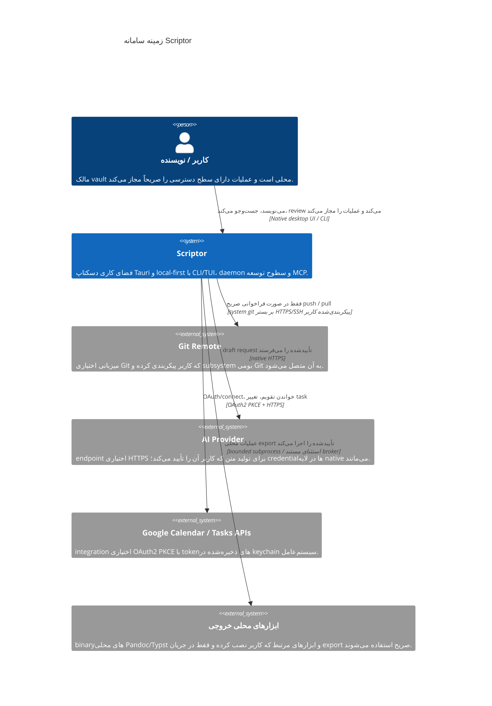

[English](c4-context.md) · **فارسی** · [简体中文](c4-context.zh-CN.md) · [Русский](c4-context.ru.md) · [Deutsch](c4-context.de.md) · [Español](c4-context.es.md)

# مشخصات مدل <bdi dir="ltr">C4:</bdi> زمینه سامانه <bdi dir="ltr">Scriptor</bdi> در سطح ۱

[<bdi dir="ltr">English</bdi>](c4-context.md) · [简体中文](c4-context.zh-CN.md) · [Русский](c4-context.ru.md) · [<bdi dir="ltr">Deutsch</bdi>](c4-context.de.md) · [<bdi dir="ltr">Espa</bdi>ñ<bdi dir="ltr">ol</bdi>](c4-context.es.md) · **فارسی**

**وضعیت:** زمینه پیاده‌سازی فعلی <bdi dir="ltr">Scriptor</bdi> <bdi dir="ltr">`1.0.0`</bdi> به‌همراه سخت‌سازی‌های هنوز منتشرنشده در این <bdi dir="ltr">tree.</bdi> سطوح آزمایشی و صرفاً طراحی‌شده تابع [`../CAPABILITY-MATURITY.md`](../CAPABILITY-MATURITY.md) هستند.

## نمای کلی سامانه

<bdi dir="ltr">Scriptor</bdi> یک فضای کاری دسکتاپ <bdi dir="ltr">local-first</bdi> برای دانش و نوشتن با <bdi dir="ltr">Markdown</bdi> است. <bdi dir="ltr">Markdown</bdi> موجود در <bdi dir="ltr">filesystem</bdi> کاربر مرجع اصلی است؛ <bdi dir="ltr">index</bdi>های <bdi dir="ltr">SQLite</bdi> و <bdi dir="ltr">artifact</bdi>های تولیدشده برای <bdi dir="ltr">publish/export</bdi> حالت مشتق‌شده‌اند.

## پرسوناها

| پرسونا | هدف اصلی | گردش‌کارهای پیاده‌سازی‌شده |
|---|---|---|
| پژوهشگر | نوشتن و سازمان‌دهی یادداشت‌های منابع و <bdi dir="ltr">draft</bdi>ها | ویرایش <bdi dir="ltr">Markdown</bdi>، بررسی محلی <bdi dir="ltr">bibliography/citation</bdi>، مطالعه و <bdi dir="ltr">annotation</bdi> فایل‌های <bdi dir="ltr">PDF/EPUB</bdi>، <bdi dir="ltr">graph/search</bdi> |
| نویسنده فنی | تولید مستندات ساختاریافته | <bdi dir="ltr">editor/preview</bdi>، <bdi dir="ltr">profile</bdi>های خروجی، گردش‌کار <bdi dir="ltr">Git</bdi> و انتشار محلی <bdi dir="ltr">Starlight</bdi> پس از <bdi dir="ltr">review</bdi> |
| کاربر دانشی | نگه‌داری یک پایگاه دانش شخصی و قابل‌انتقال | <bdi dir="ltr">index</bdi> کردن <bdi dir="ltr">vault</bdi>، جست‌وجوی تمام‌متن، <bdi dir="ltr">backlink/graph</bdi>، <bdi dir="ltr">task/Kanban</bdi> و <bdi dir="ltr">capture</bdi> |

## زمینه سامانه

<bdi dir="ltr">repository</bdi> یک <bdi dir="ltr">connector package</bdi> فقط‌خواندنی برای <bdi dir="ltr">Zotero Web API</bdi> دارد، اما این <bdi dir="ltr">package</bdi> **داخل <bdi dir="ltr">runtime</bdi> منتشرشده <bdi dir="ltr">desktop/CLI/daemon</bdi> ترکیب نشده است**؛ بنابراین در این نمودار به‌عنوان رابطه فعال با سامانه خارجی نشان داده نمی‌شود.

## مرزهای اعتماد

1. **<bdi dir="ltr">vault</bdi> محلی:** <bdi dir="ltr">Markdown</bdi> و <bdi dir="ltr">asset</bdi>های کاربر روی <bdi dir="ltr">disk</bdi> مرجع اصلی باقی می‌مانند. <bdi dir="ltr">index</bdi>های مشتق و خروجی <bdi dir="ltr">publish</bdi> قابل بازسازی‌اند.
2. **مرز <bdi dir="ltr">renderer/native:</bdi>** <bdi dir="ltr">renderer</bdi> مجوز <bdi dir="ltr">filesystem</bdi>، <bdi dir="ltr">keychain</bdi>، <bdi dir="ltr">Git</bdi>، <bdi dir="ltr">network</bdi>، <bdi dir="ltr">process</bdi>، <bdi dir="ltr">backup</bdi> یا <bdi dir="ltr">publish</bdi> ندارد. کد <bdi dir="ltr">native</bdi> مسیرها، <bdi dir="ltr">payload</bdi>ها و <bdi dir="ltr">grant</bdi>های حساس را دوباره اعتبارسنجی می‌کند.
3. **مرز <bdi dir="ltr">daemon:</bdi>** <bdi dir="ltr">CLI/TUI</bdi> و <bdi dir="ltr">daemon MCP</bdi> از پروتکل محلی و <bdi dir="ltr">typed</bdi> <bdi dir="ltr">`scriptor-ipc`</bdi> با <bdi dir="ltr">endpoint metadata</bdi> احراز اصالت‌شده، بررسی <bdi dir="ltr">nonce</bdi> و <bdi dir="ltr">framing</bdi> محدود استفاده می‌کنند. این مرز با <bdi dir="ltr">Tauri renderer IPC</bdi> متفاوت است.
4. **فرایندهای خارجی:** اجراهای پشتیبانی‌شده از <bdi dir="ltr">process broker</bdi> عبور می‌کنند، مگر استثنای محدود و مستندی که همان <bdi dir="ltr">bounds</bdi> و <bdi dir="ltr">policy</bdi> را اعمال کند.
5. **شبکه خارجی:** <bdi dir="ltr">integration</bdi>های <bdi dir="ltr">Git</bdi>، <bdi dir="ltr">AI</bdi> و <bdi dir="ltr">Google</bdi> اختیاری‌اند و احراز هویت اختصاصی خود را دارند. <bdi dir="ltr">fallback</bdi> شبکه‌ایِ ضمنی وجود ندارد.

