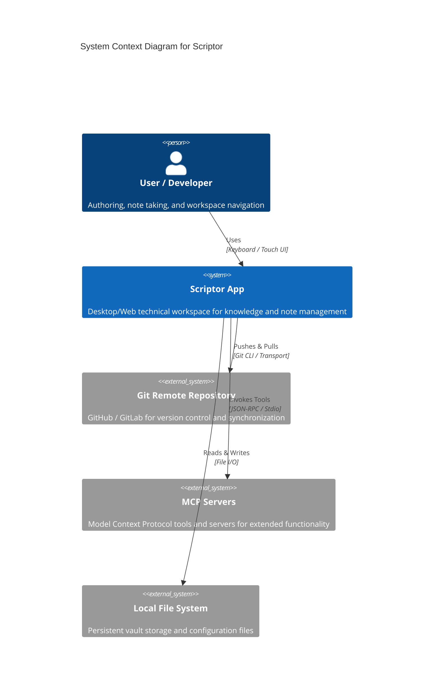

# System Context Overview (C4 Level 1)

## Personas & User Journeys
1. **Developer / Power User**: Interacts with Scriptor to manage markdown notes, visualize knowledge graphs, configure MCP extensions, and manage Git repositories.
2. **Technical Writer**: Authors structured documentation, reviews history, and publishes artifacts.
3. **Agentic Auditor**: Conducts automated code quality, performance, and accessibility reviews.

## System Context Diagram

