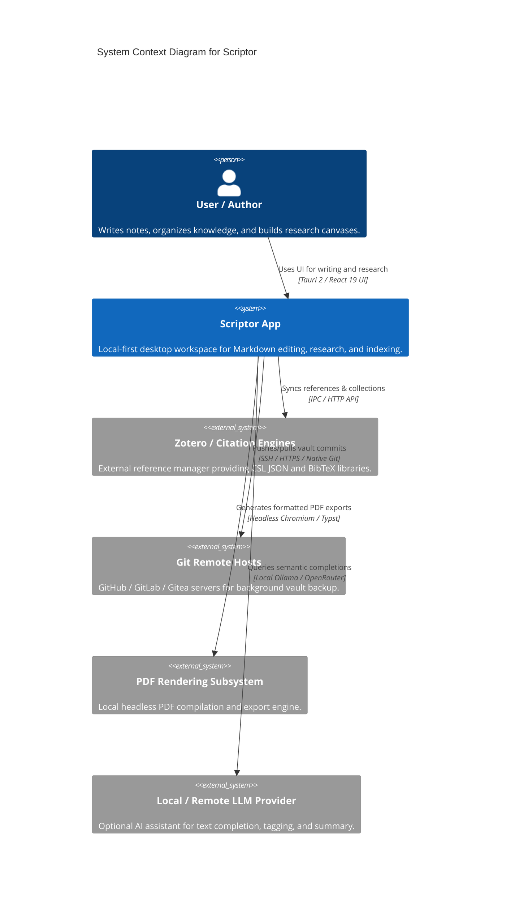

# C4 Model Specification: Level 1 System Context for Scriptor

> **Specification Standard:** C4 Model Level 1 System Context (`architecture-c4-model`) for Scriptor (`D:\GitHub\Scriptor`).

## 1. System Overview

**Scriptor** is a local-first, privacy-focused Markdown knowledge and writing workspace for desktop users. It combines long-form Markdown note editing, interactive canvas research, citation management, full-text search indexing, and automated Git synchronization into a desktop application shell.

---

## 2. Personas & Stakeholders

| Persona | Role & Primary Goal | Key Workflows |
|---|---|---|
| **Academic Researcher** | Manages citations, literature notes, and paper drafts. | Zotero reference sync, PDF annotation, bibtex/CSL citation generation. |
| **Technical Writer** | Authors structured documentation, API guides, and Markdown books. | Split editor preview, canvas diagramming, automated Git commits. |
| **Knowledge Worker** | Builds a personal knowledge graph (PKM) from daily notes and web clips. | Vault indexing, full-text search, bidirectional link traversal. |

---

## 3. External System Dependencies & Trust Boundaries

---

## 4. Trust Boundaries & Security Model

1. **Local Vault Boundary:** Vault files (`.md`, `.canvas`, images) are stored strictly as plain text on the local filesystem (`D:\GitHub\Scriptor` or user vaults). No vault data is sent to external servers without explicit user invocation.
2. **Process Launch Isolation:** System commands and external tools are launched through `crates/system-bridge` with explicit authorization inventory checks against `scripts/validation/process-launch-inventory.json`.
3. **Network Isolation:** Third-party integrations (Zotero, Git remotes, LLMs) use authenticated nonces and encrypted local storage for credentials.
