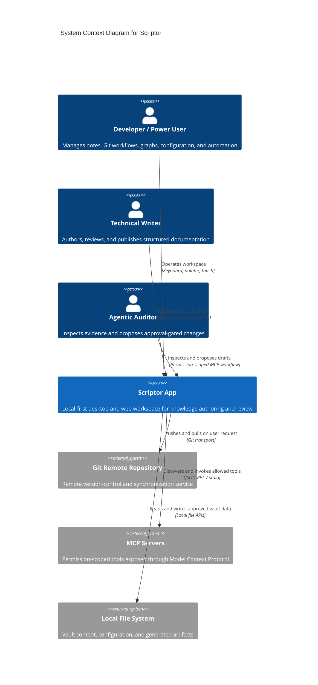

# System context overview (C4 level 1)

## Personas and journeys

1. **Developer / Power User** manages Markdown notes, knowledge graphs, Git workflows, workspace configuration, and MCP-assisted automation.
2. **Technical Writer** authors structured documentation, reviews changes and history, and publishes output artifacts.
3. **Agentic Auditor** inspects repository and workspace evidence through explicitly permitted read or draft-producing MCP tools; write operations remain approval-gated.

## System context diagram

