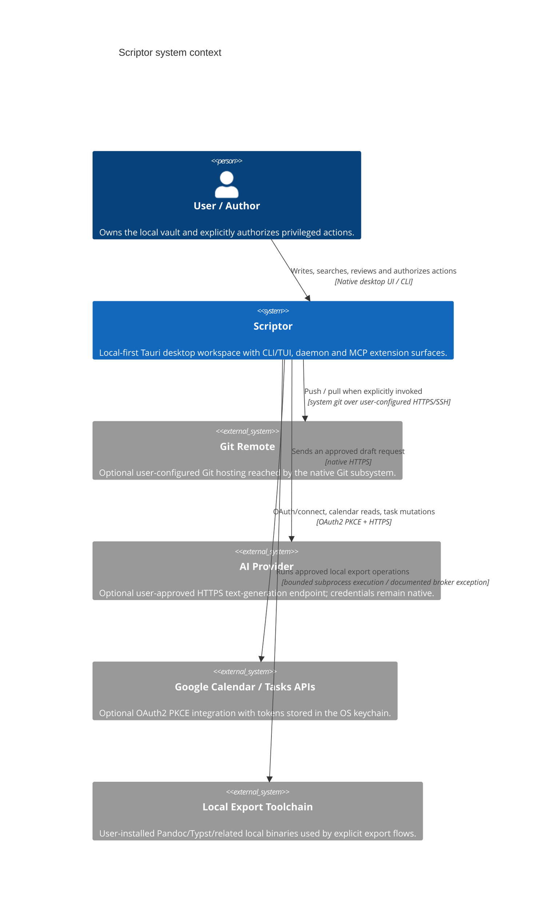

# C4 Model Specification: Level 1 System Context for Scriptor

**Status:** current implementation context for Scriptor `1.0.0` plus the Unreleased hardening in this tree. Experimental and design-only surfaces are governed by [`../CAPABILITY-MATURITY.md`](../CAPABILITY-MATURITY.md).

## System overview

Scriptor is a local-first desktop Markdown knowledge and writing workspace. Markdown on the user's filesystem is authoritative; SQLite indexes and generated publish/export artifacts are derived state.

## Personas

| Persona | Primary goal | Implemented workflows |
|---|---|---|
| Researcher | Write and organize literature notes and drafts | Markdown editing, local bibliography/citation inspection, PDF/EPUB reading and annotations, graph/search |
| Technical writer | Produce structured documentation | Editor/preview, export profiles, Git workflows, reviewed local Starlight publishing |
| Knowledge worker | Maintain a portable personal knowledge base | Vault indexing, full-text search, backlinks/graph, tasks/Kanban, capture |

## System context

The repository contains a read-only Zotero Web API connector package, but it is **not composed into the shipped desktop/CLI/daemon runtime** and therefore is not represented as a live external-system relationship.

## Trust boundaries

1. **Local vault:** Markdown and user assets remain authoritative on disk. Derived indexes and publish output are rebuildable.
2. **Renderer/native boundary:** the renderer is not trusted with filesystem, keychain, Git, network, process, backup, or publish authority. Native code revalidates paths, payloads and sensitive grants.
3. **Daemon boundary:** CLI/TUI and daemon MCP use the typed `scriptor-ipc` local protocol with authenticated endpoint metadata, nonce checks and bounded framing. This is distinct from Tauri renderer IPC.
4. **External processes:** supported launches use the process broker unless a narrowly documented broker exception owns equivalent bounds and policy.
5. **External network:** Git, AI and Google integrations are opt-in and use integration-specific authentication. There is no ambient network fallback.
