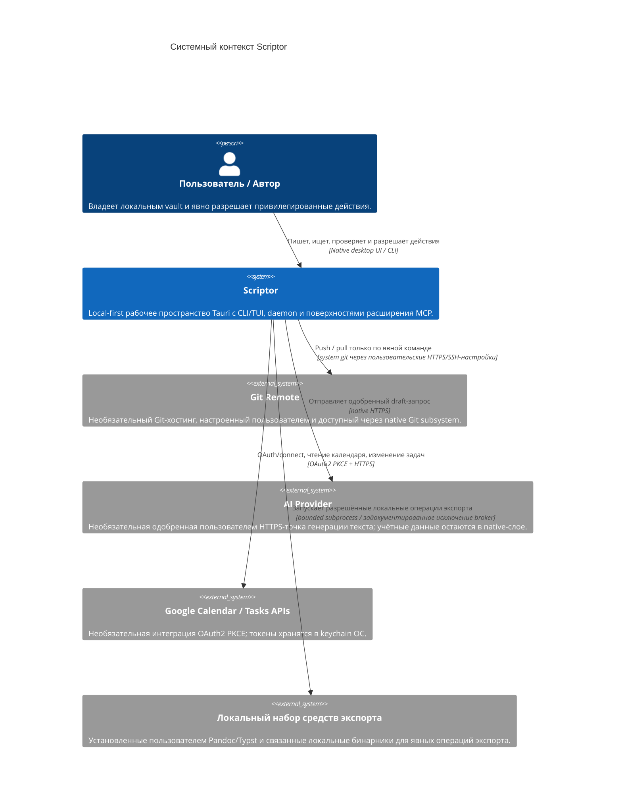

# Спецификация модели C4: системный контекст Scriptor, уровень 1

[English](c4-context.md) · [简体中文](c4-context.zh-CN.md) · **Русский** · [Deutsch](c4-context.de.md) · [Español](c4-context.es.md) · [فارسی](c4-context.fa.md)

**Статус:** текущий контекст реализации Scriptor `1.0.0` вместе с ещё не выпущенным усилением в этом дереве. Экспериментальные и design-only поверхности регулируются [`../CAPABILITY-MATURITY.md`](../CAPABILITY-MATURITY.md).

## Обзор системы

Scriptor — local-first настольное рабочее пространство для знаний и письма в Markdown. Markdown-файлы в файловой системе пользователя являются источником истины; SQLite-индексы и сгенерированные publish/export-артефакты — производное состояние.

## Персоны

| Персона | Основная цель | Реализованные рабочие процессы |
|---|---|---|
| Исследователь | Писать и систематизировать литературные заметки и черновики | Редактирование Markdown, локальная проверка библиографии/цитат, чтение и аннотации PDF/EPUB, graph/search |
| Технический автор | Выпускать структурированную документацию | Editor/preview, профили экспорта, Git-workflow, проверенная локальная публикация Starlight |
| Специалист по знаниям | Поддерживать переносимую личную базу знаний | Индексация vault, полнотекстовый поиск, backlinks/graph, задачи/Kanban, capture |

## Системный контекст

Репозиторий содержит read-only connector package для Zotero Web API, но он **не включён в поставляемый runtime desktop/CLI/daemon**, поэтому не показан как активная связь с внешней системой.

## Границы доверия

1. **Локальный vault:** Markdown и пользовательские ресурсы на диске остаются источником истины. Производные индексы и publish-выход можно восстановить.
2. **Граница renderer/native:** renderer не обладает полномочиями файловой системы, keychain, Git, сети, процессов, резервных копий или публикации. Native-код повторно проверяет пути, payload и чувствительные grants.
3. **Граница daemon:** CLI/TUI и daemon MCP используют типизированный локальный протокол `scriptor-ipc` с аутентифицированными endpoint metadata, проверками nonce и ограниченным framing. Это отдельная граница от Tauri renderer IPC.
4. **Внешние процессы:** поддерживаемые запуски проходят через process broker, кроме узких задокументированных исключений с эквивалентными лимитами и политикой.
5. **Внешняя сеть:** интеграции Git, AI и Google включаются только по желанию и используют собственные схемы аутентификации. Неявного сетевого fallback нет.
