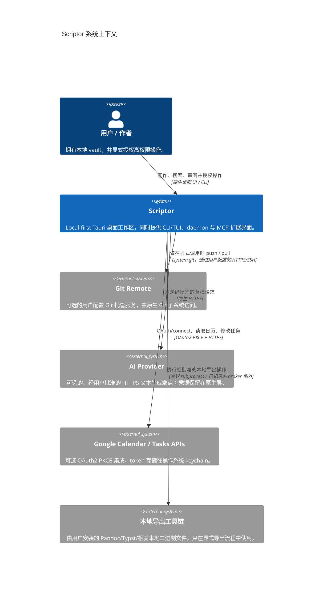

# C4 模型规范：Scriptor 一级系统上下文

[English](c4-context.md) · **简体中文** · [Русский](c4-context.ru.md) · [Deutsch](c4-context.de.md) · [Español](c4-context.es.md) · [فارسی](c4-context.fa.md)

**状态：** 当前实现上下文覆盖 Scriptor `1.0.0`，以及本源码树中尚未发布的加固工作。实验性和仅设计阶段的界面以 [`../CAPABILITY-MATURITY.md`](../CAPABILITY-MATURITY.md) 为准。

## 系统概览

Scriptor 是一个 local-first 的桌面 Markdown 知识与写作工作区。用户文件系统中的 Markdown 是权威数据；SQLite 索引以及生成的发布/导出产物都属于派生状态。

## 用户角色

| 角色 | 主要目标 | 已实现工作流 |
|---|---|---|
| 研究者 | 编写、整理文献笔记和草稿 | Markdown 编辑、本地参考文献/引文检查、PDF/EPUB 阅读与注释、graph/search |
| 技术写作者 | 产出结构化文档 | Editor/preview、导出 profile、Git 工作流、经审核的本地 Starlight 发布 |
| 知识工作者 | 维护可迁移的个人知识库 | Vault 索引、全文搜索、backlinks/graph、任务/Kanban、capture |

## 系统上下文

仓库包含一个只读的 Zotero Web API connector package，但它**没有组合进已发布的 desktop/CLI/daemon runtime**，因此不作为活跃外部系统关系出现在该图中。

## 信任边界

1. **本地 vault：** Markdown 与用户资产在磁盘上保持权威；派生索引与发布输出均可重建。
2. **Renderer/native 边界：** renderer 不被授予 filesystem、keychain、Git、network、process、backup 或 publish 权限。原生代码会重新验证 path、payload 和敏感 grant。
3. **Daemon 边界：** CLI/TUI 与 daemon MCP 使用带类型的 `scriptor-ipc` 本地协议，其中包含经过认证的 endpoint metadata、nonce 检查和有界 framing；它与 Tauri renderer IPC 相互独立。
4. **外部进程：** 受支持的启动操作通过 process broker 执行，除非某个范围极窄且有文档记录的 broker 例外承担了等价的限制和策略。
5. **外部网络：** Git、AI 和 Google 集成都必须显式启用，并各自采用专用认证。不存在环境式的网络 fallback。
