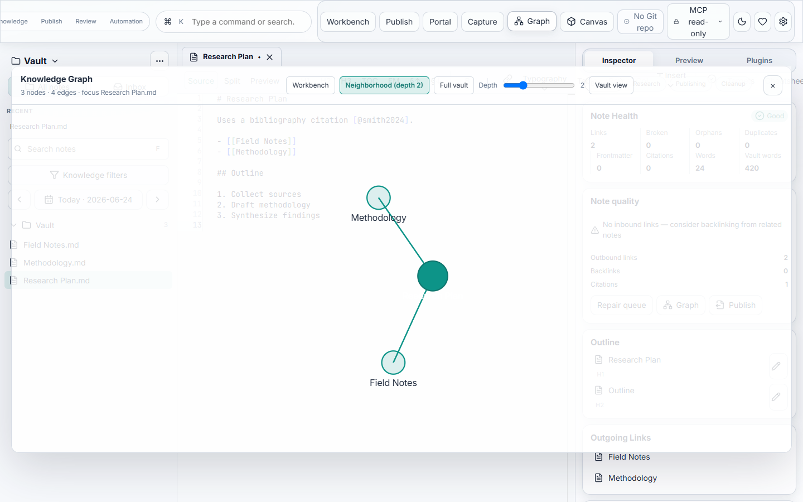

# Getting Started with Scriptor

Scriptor is a local-first Markdown knowledge workspace. This guide covers installation, opening your first vault, and the core workflows you will use every day.


## Install

### Pre-built installers

Download the latest release for your platform from [GitHub Releases](https://github.com/AmirrezaFarnamTaheri/Scriptor/releases):

| Platform | Formats |
|----------|---------|
| Windows | MSI or NSIS installer |
| macOS | DMG |
| Linux | DEB or AppImage |

### Build from source

**Requirements:** Node.js 22+, pnpm 9+, Rust stable.

```powershell
git clone https://github.com/AmirrezaFarnamTaheri/Scriptor.git
cd Scriptor
pnpm install
pnpm desktop:dev
```

## Open a vault

1. Launch **Scriptor**.
2. Choose **Open Vault** and select any folder containing Markdown notes.
3. Scriptor indexes the vault in the background — no proprietary database is required.

Your files remain plain Markdown on disk. Scriptor reads and writes them directly.

### Vault configuration

Vault settings live in `.scriptor/config.json`. Snippets, export profiles, and plugin manifests are colocated under `.scriptor/`.

## The workspace

| Region | Purpose |
|--------|---------|
| **Vault sidebar** | Browse, search, and filter notes; create daily notes and templates |
| **Editor** | Write in Source, Split, or Preview mode with Monaco or CodeMirror |
| **Inspector rail** | Outline, links, backlinks, citations, note health, and export profiles |
| **Status dock** | Output log, search results, diagnostics, and background jobs |

Use the top bar workspace modes — **Writing**, **Knowledge**, **Publish**, **Review**, **Automation** — to focus the toolbar and command palette on the task at hand.

## Core workflows

| Task | Desktop | Terminal (`scriptor tui`) |
|------|---------|--------------------------|
| Browse notes | Vault sidebar | `j` / `k` |
| Search | Sidebar search or `Ctrl+K` | `/` then query |
| Command palette | `Ctrl+K` or top bar search | — |
| Preview | Editor **Split** or **Preview** mode | `p` |
| Backlinks | Inspector rail | `b` |
| Graph | **Graph** toolbar button | `g` |
| Vault health | Inspector **Note Health** or Settings | `h` |
| Export | Inspector export profiles or **Publish** | `scriptor export` |
| Git status | Top bar Git indicator | — |



## Export setup

Scriptor exports through [Pandoc](https://pandoc.org/). Install Pandoc on your system for real exports (HTML, PDF, DOCX, LaTeX, ePub, Reveal.js slides):

```powershell
# Windows
winget install --id JohnMacFarlane.Pandoc

# macOS
brew install pandoc
```

Dry-run export previews work without Pandoc. See [`docs/release/PANDOC_STRATEGY.md`](../release/PANDOC_STRATEGY.md) for discovery, overrides, and troubleshooting.

## Optional: headless engine

Enable **Settings → Headless engine** to route indexing, search, backlinks, graph, Git status, and export jobs through the local daemon. Vault open and canvas stay in-process for responsiveness. See [`docs/architecture/IPC_DAEMON.md`](../architecture/IPC_DAEMON.md).

## Further reading

- [`docs/CAPABILITIES.md`](../CAPABILITIES.md) — full feature map
- [`docs/contracts/COMMAND_CATALOG.md`](../contracts/COMMAND_CATALOG.md) — Tauri, daemon, and CLI commands
- [`docs/architecture/PLUGIN_SYSTEM.md`](../architecture/PLUGIN_SYSTEM.md) — plugins and marketplace
- [`docs/design/DESIGN_SYSTEM.md`](../design/DESIGN_SYSTEM.md) — visual system tokens
- [`docs/brand/BRAND.md`](../brand/BRAND.md) — logo and wordmark
- [`docs/assets/screenshots/README.md`](../assets/screenshots/README.md) — regenerate UI screenshots
