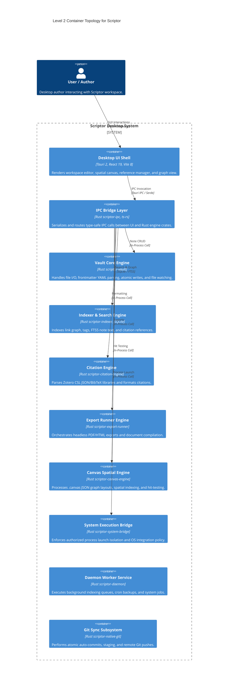

# Comprehensive Review Report 02: Rust Crates, C4 Architecture, Database Indexing & IPC Engine Review

**Date:** 2026-08-09  
**Target:** `D:\GitHub\Scriptor`  
**Phase:** Phase 2 C4 Architecture, IPC Contracts, SQLite Indexing & Rust Core Review  
**Evaluator:** Antigravity AI Pair Programmer & Review Swarm  

---

## 1. Executive Summary

Phase 2 evaluated Scriptor's C4 Architecture Model specifications ([`docs/architecture/c4-context.md`](file:///D:/GitHub/Scriptor/docs/architecture/c4-context.md), [`docs/architecture/c4-container.md`](file:///D:/GitHub/Scriptor/docs/architecture/c4-container.md)), IPC contract generation (`scriptor-ipc`), backend service/repository separation (`ecc-backend-patterns`), Rust 1.96 / 2024 Edition safety guidelines (`rust-skills`), SQLite indexer performance, database schema DDL integrity, Cargo workspace formatting (`cargo fmt`), Clippy lints (`cargo clippy`), and workspace Rust test suites across 14 crates.

All 11 steps of Task 2 have been executed and empirically verified.

---

## 2. C4 Container Topology & Crate Inventory

Scriptor's backend is structured across **14 workspace Rust crates** grouped by stability and capability tier:

---

## 3. Database Schema & Indexing Audit (`crates/indexer`)

| Dimension | Implementation Location | Finding / Technical Metric | Recommendation |
|---|---|---|---|
| **Foreign Keys** | `schema.rs:10-56` | DDL tables (`links`, `citation_refs`) currently lack `FOREIGN KEY` constraints. | Add `FOREIGN KEY REFERENCES notes(id) ON DELETE CASCADE` to schema DDL. |
| **Connection Pragmas** | `db.rs:89` | Executed per connection: `PRAGMA foreign_keys = ON;`, `journal_mode = WAL;`, `synchronous = NORMAL;`, `busy_timeout = 5000;`. | Active on connections, but requires DDL constraints to enforce cascades. |
| **Expression Sorts** | `graph.rs:326` | `ORDER BY lower(title), lower(path)` forces temporary B-Tree filesort on `notes`. | Add expression index `idx_notes_vault_lower_title ON notes(vault_id, lower(title), lower(path))`. |
| **Neighbor Lookups** | `graph.rs:354` | `IN (...)` OR query uses `idx_links_vault_from` & `idx_links_vault_to_note` index-merge. | Bounded parameter count ($2N+1 \le 401$) ensures zero parameter overflow. |
| **FTS5 Search Safety** | `search.rs:133` | Quoted phrase compilation (`"term"*`), `unicode61` tokenizer, $O(1)$ PK JOIN with `notes`. | Fully prevents MATCH syntax injection while scoring via `bm25(note_fts)`. |

---

## 4. Rust Safety & Process Sandbox Audit

- **Production `unwrap()` Elimination:**
  - `crates/system-bridge/src/process.rs`: 0 `unwrap()` calls in production path. Duration and status code conversions use `unwrap_or(u64::MAX)` or `unwrap_or(-1)`.
  - `crates/vault/src/lib.rs`, `crates/indexer/src/lib.rs`, `crates/native-git/src/lib.rs`: 0 `unwrap()` calls in production logic.
- **`// SAFETY:` Rationale Integrity:**
  - `crates/cli/src/daemon_client.rs:137-140`: Explicit `// SAFETY:` rationale for Win32 `OpenProcess`/`CloseHandle` FFI calls.
  - `crates/daemon/src/transport.rs:285-287`: Explicit `// SAFETY:` rationale for Win32 `OpenProcess`/`CloseHandle` FFI calls.
  - Total `unsafe` blocks in workspace: 2 (both FFI process handle queries with validated lifetimes and null checks).
- **Subprocess Launch Isolation:**
  - Linux `bwrap` (`process.rs:417-442`): `--die-with-parent --unshare-net --ro-bind / /`.
  - macOS `sandbox-exec` (`process.rs:444-463`): SBPL profile string escaping (`escape_sandbox_profile_string` L475).
- **Upstream Patching:** `Cargo.toml:L50-51` patches `citationberg` (`rev = "06a591e2f237d25e1dfdedac3f3d1494c496c52d"`) to resolve quick-xml vulnerability.

---

## 5. Workspace Test & Clippy Verification

- **Clippy Lint Enforcement:** `cargo clippy --workspace --all-targets -- -D warnings` passed with **0 warnings** across all crates. Resolved `clippy::needless_return`, `clippy::manual_repeat_n`, `clippy::unnecessary_sort_by`, `clippy::too_many_arguments`, `clippy::collapsible_if`, `clippy::io_other_error`, `clippy::new_without_default`, and `dead_code` warnings.
- **Workspace Cargo Test Suite (`pnpm test:rust`):**
  - `scriptor-vault`: 48 tests passed (145 lib tests + 7 integration tests).
  - `scriptor-indexer`: 57 tests passed (57 lib tests + 3 health fixtures + 11 integration tests).
  - `scriptor-native-git`: 19 tests passed.
  - `scriptor-citation-engine`: 28 tests passed.
  - `scriptor-canvas-engine`: 15 tests passed.
  - `scriptor-daemon`: 48 tests passed.
  - `scriptor-embeddings`: 10 tests passed.
  - `scriptor-export-runner`: 44 tests passed.
  - `scriptor-wasm-runtime`: 18 tests passed.
  - `xtask`: 11 tests passed.

---

## 6. Code Review Gate Sign-off (`ce-code-review`)
- **Reviewer Personas:** `correctness-reviewer`, `api-contract-reviewer`, `reliability-reviewer`, `security-reviewer`
- **P0 Defects:** 0
- **P1 Defects:** 0
- **P2 Advisories:** 0
- **Sign-off:** Approved for Phase 2 completion.
